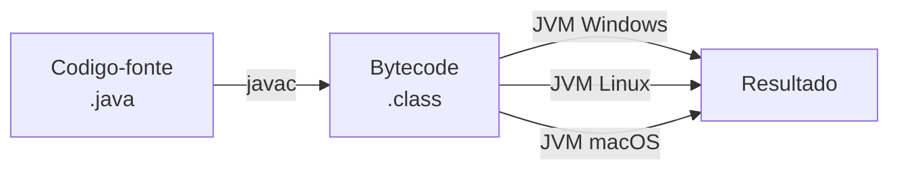
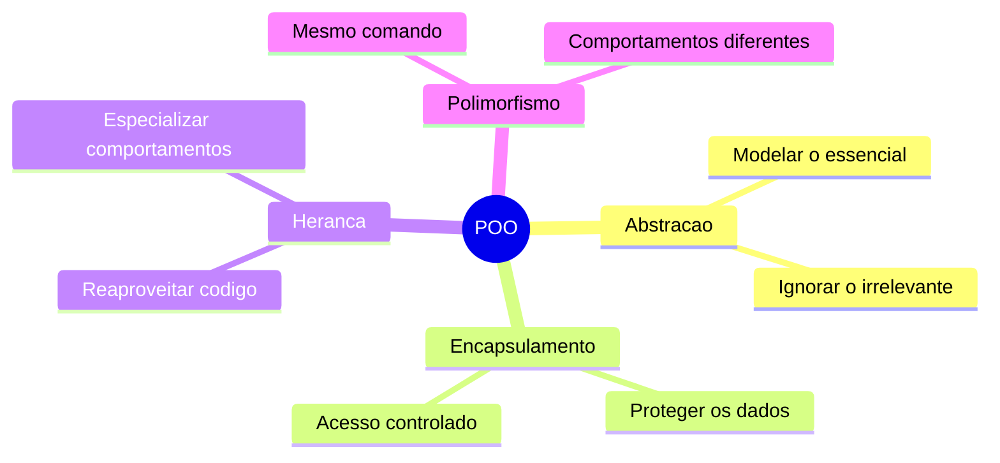
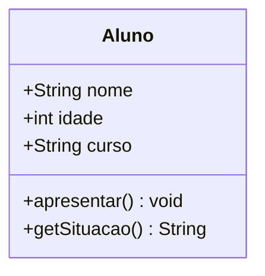
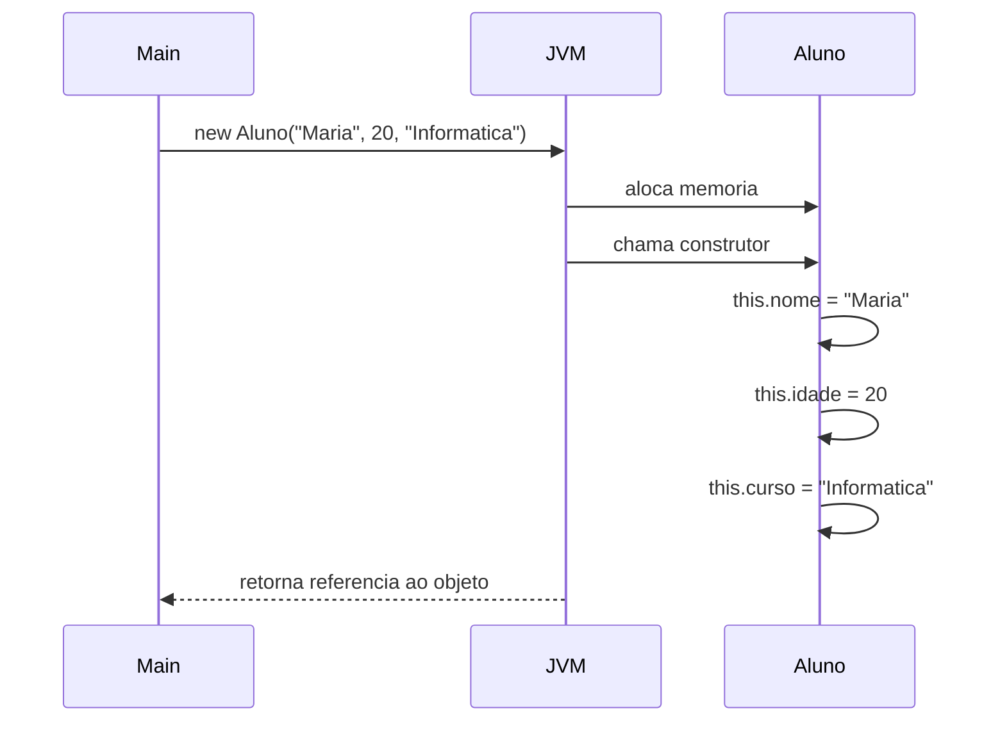
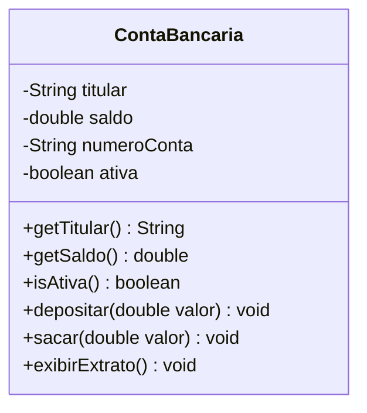
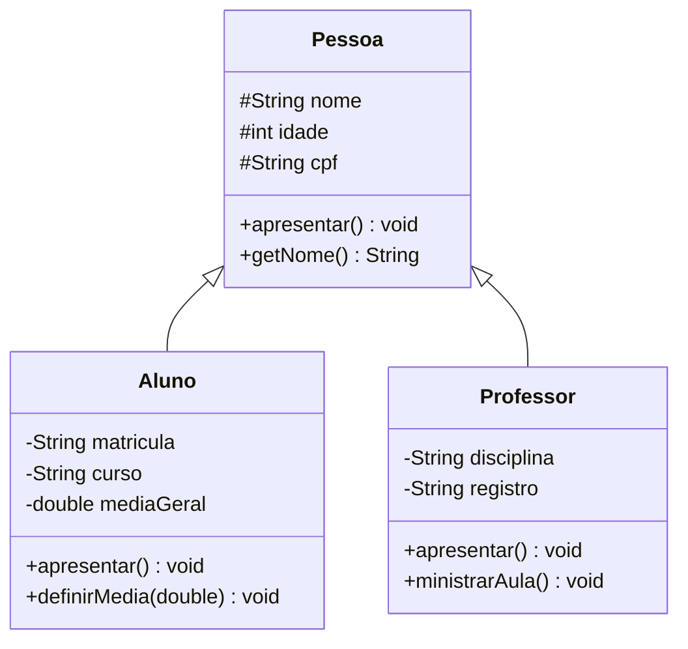
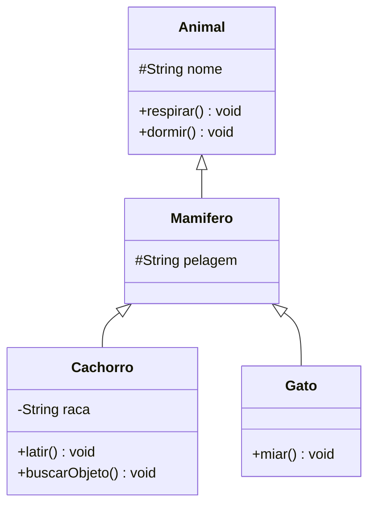
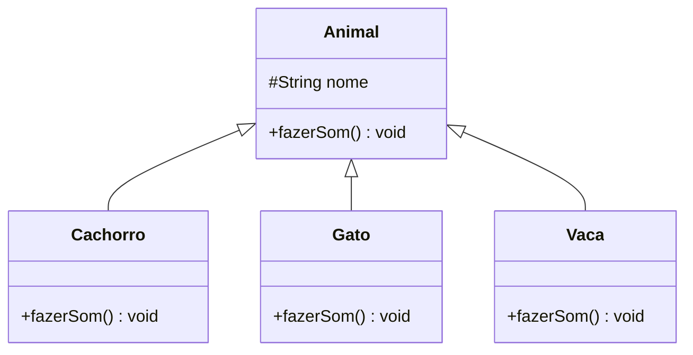
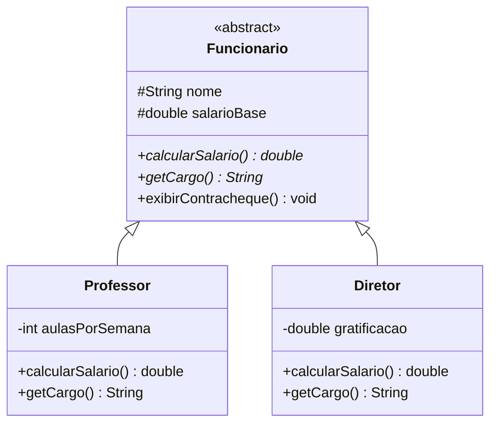
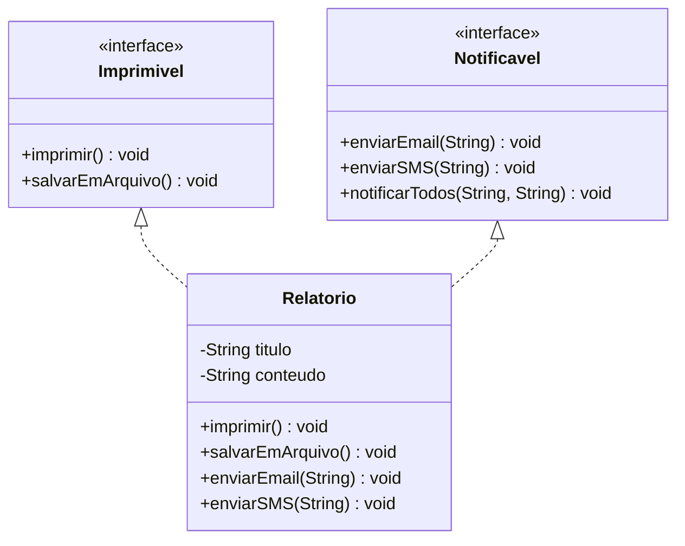

<div align="center">

<img src="data:image/png;base64,iVBORw0KGgoAAAANSUhEUgAAAeAAAAD7CAYAAACyskd5AAAfZ0lEQVR4nO3dd3xUVf7/8c8lBRJKAhESEQQx/Cg/SYL0EgjBmAARBKTtLhD4gi5SVgWWSFHRpS0gkSISlWpdilLCRiBSEooUQ9MFESwUAwpKKEMKnO8ffJmdm5lJYyYnyuv5ePB4cO6ce865k2Tec89thlJKAABAySqjewAAANyLCGAAADQggAEA0IAABgBAAwIYAAANCGAAADQggAEA0IAABgBAAwIYAAANCGAAADQggAEA0IAABgBAAwIYAAANCGAAADQggAEA0IAABgBAAwIYAAANCGAAADQggAEA0IAABgBAAwIYAAANCGAAADQggAEA0IAABgBAAwIYAAANCGAAADQggAEA0IAABgBAAwIYAAANCGAAADQggAEA0IAABgBAAwIYAAANCGAAADQggAEA0IAABgBAAwIYAAANCGAAADQggAEA0IAABgBAAwIYAAANCGAAADQggAEA0IAABgBAAwIYAAANCGAAADQggAEA0IAABgBAAwIYAAANCGAAADQggAEA0IAABgBAAwIYAAANCGAAADQggAEA0IAABgBAAwIYAAANCGAAADQggAEA0IAABgBAAwIYAAANCGAAADQggAEA0IAABgBAAwIYAAANCGAAADQggAEA0IAABgBAAwIYAAANCGAAADQggAEA0IAABgBAAwIYAAANCGAAADQggAEA0IAABgBAAwIYAAANCGAAADQggAEA0IAABgBAA0/dA7iXXDx0WF1J+rdc37lLcs/9JLeuXRWPypXFq1YtKd8hQmoOe9rQPUYAQMkwlFK6x3BP+HbEc+rK2nWibt50WqdMhfJSeej/SK2xox0G8aEzR9X/pLwgubdyiz2Osh7esrDDDHm0Zqi1j9YruqjruZZit2mIIdPaTJCY/xfJFwgAKCSmoN3s4pfp6nDz1ipzzSf5hq+IyK2r1+TinLlyrFc/h9+KLlh+uavwFRHJupktP127YC0fOfv1XYWviIgSJWev/nRXbQDAvYYAdrOzQ/4quWfOFmmd6zt3ybGn+jI1AQB/YASwG/2nW0+Vm5FRrHWv79otP0ydTggDwB8UAewmGZ+uVZZ9+++qjUvvLnXNYAAApQ4B7Ca/vf/RXbehLBb5Ydbr7AUDwB8QAewmlr37XNLOtc+3uaQdAEDpQgC7wS979ymVk+OStrJPnnJJOwCA0oUAdoObly65rK1bV664rC0AQOlBALtBGV9fl7VleHm5rC0AQOlBALtB1XbhLrsjlEdgNVc1BQAoRQhgN/GqXdsl7ZRv09ol7QAAShcC2E0qdYlxSTsVOkW7pB0AQOlCALtJrQkvGh7+/nfVhk/zZhL4eBQPOACAPyAC2I2qThovYhQvP8tUrCDVXn3ZxSMCAJQWBLAbVe/Xx6gycniR1zPKlZP7E2ZLQEgj9n4B4A+KAHaz2vFjjcDpU8Qo5KVJnjUekJofLJfATjF24etZxtMlY/Is42H9f6MHGrok5D0Nj4IrAQCsDKW41XBJOTVuvLqy8d9y86L9jTq8H6otfn16Sc1RI/INxEX7l6nM7KvFHkMFr/IyrFmcqY9l6R+pC5aLxW7T28NL/tbiafbWAaAICGANftnzhco595PcunxZPAICJKhrLOEFAPcYAhgAAA04BgwAgAauOasHdvZ8v1+N3z1Vcm7mFruNQN/7ZFWPxabp6cc/6q0suTeK3WalshUlqdf7THkDgGYEsJsc//VbuXTjt7tq48rlq/Ll6UPq0ZqhhojI5hPb1AXLL3fXZs5VSTq2WXWpzw0+AEAnpqABANCAAAYAQAMCGAAADQhgAAA0IIABANCAAAYAQAMCGAAADQhgAAA0IIABANCAAAYAQAMCGAAADQhgAAA0IIABANCAAAYAQAMC2E0MwzVvrWHzIzIM1zxBsIyL2gEAFB/PA3aTAWG9ja8uHlPZt3KK3UaVsv7SuGYja1o+FtzeeOLM4+pqzrVit1ney1c61XuMBAYAzQyllO4xAABwz2EKGgAADZiCRonavXu3dcqlVatWpqnwgwcPqitXrljLFSpUkMaNG9tNlx8+fFhdvnzZWg4PD3c6pb5q1Sr1zTffSHZ2tlSpUkWqVasmDRo0kNDQULt1bMdWWLbb4GzbitOul5eXNG3a1BARSU1Nta7v6elp976JiKSnp6urV69ay7bvyd1uV14bN25Ux44dk8zMTKlYsaI89NBD0qNHj7s6rFHYMToaV3HXtX1fRUQqVqwoYWFhRd4OV/V/h5+fn4SEhBR5HHnby+/v4o78/h7hfkxBu9GA9SNUVm5WsdevXiFI5kS9ZvqjGJL0vLqSfdXZKgWqXM5P3uo0y9TmiM9eVD9f/6XYbXp7eMuYR4dJaI1H8v0DHjRokFq6dKm1/NZbb8kzzzxjXadjx47q888/t77u4+Mj169ft2uzW7duat26ddayUsquzvz589VLL70kv/76q8OxBAUFSVxcnEybNs0QEYmLi1PLli3Lb/jOtkkWL15svPPOO2ro0KHW5f3795fly5cbH330kerXr1+R273//vvl3LlzhoiIYRjWP9Jq1arJ+fPn7bY3PDxcpaWlWctbtmyRjh07GpGRkWrr1q1F7n/SpEny6quvmvqZMmWKmj17tsP31NfXV4YNGyazZs0q8of43r17VYsWLQpV99lnn5UFCxZY+4iKilJbtmwp1Lq2vyfr1q1T3bp1c1q3SpUq0rhxY+nSpYs8//zzTrfJXf2LiNSrV08GDBgg48ePL/A9XbJkiRo8eLBpWcOGDeWrr75yum6vXr3UqlWrrOUVK1bIX/7yF0K4BLEH7CbLD36sDv/y9V21cfy3k5J++rBqXPP2t+HNJ7ar/RcO3fXYNh7frDrXi7L+oaWd++Ku2zxw4bCE1njkrtuxZbFY5OWXX1aTJ08u0ofCwoUL1ciRI/Otk5GRIXv37r2r8d1LYmNjVVJSktPXr1+/LrNnz5aUlBSVnp7+u/8Qv3TpkqSkpEhKSoq8/vrr6qOPPpI2bdqU6HYdP35cJkyYIF988YVau3Ztvn1v2LDBbtnXX38t6enpytEsEkoHjgG7iatmFpQoU8klbdo0c+Ts1y5pVLlobHm99dZbRV7n5ZdfNpXLlCkjgYGBEhgYKB4eHq4a2j0jLi7OLny9vLykevXqUrZsWdPygwcPSmRk5B9qWu3MmTMSExMjaWlpWrZr3bp1sm7dunz73rx5s8Pl+X1pgn7sAaNUu3DhgixcuFANGzasUN/iN27cqH7++WdrOTo6WpKTk03rfvjhh2rJkiWmL0mDBw+WiIgIU1sbNmyQ1atXW8s9evSQJ554wlTn4Ycfznc8ffv2NW7cuGH68Pzxxx9NXxLq1KkjkyZNMq3n6+ubb7uFNXbsWBkwYIBp2dKlS2X79u3W8tChQ6V169amOo88cns2Y/PmzXZT8wMGDJBly5ZZ39P4+Hg1Y8YM6+tbt26VJUuWqEGDBhVrz+vBBx+UyZMnO3ytbt26+a47btw4qV+/fpH7DAkJkdGjR0tWVpb8+OOPsn79ejl06L+zTVevXpVBgwbJiRMn3NJ/q1atZMaMGZKTkyNfffWVvPLKK3Lp0iXr65s2bZKuXbs6XHfVqlWmcydsrV+/XiZOnFjk8aBkEMAo9RISEmTYsGGFqvvDDz+Yys8995xdnX79+hl5j8u2a9fOaNeunWnZyZMnTcHZoEEDiYuLK3Ko5F0nLS1N2QZw5cqVi9VuYXTq1Mmu3W3btinbAG7SpInT/hMTE03liIgIU/iKiEyfPt3IyMgwBfXChQtl0KBBxRqzv79/sd+Ptm3bSmxsbJHXDQoKkgEDBljXe+2112TGjBkqPj7eWufbb7+VefPmqZEjRzptv7j9V6pUyXrSVGRkpFy+fFnZfinLyMhwum7e6eeIiAjZtm2biIjs37+/qENBCWIKGqVWpUqVRETkm2++kTVr1hRq+s/T0/yd8tixY64f2D0kOTnZVB4zZozDekuXLjVs79S2b98+t46rJIwbN87405/+ZFr2/vvvl0jfDz30kKlcoUIFp3U3btxo/X+jRo3E9mSsW7duSUJCwh/qkMAfCXvAKLUGDRokb7zxhoiIzJs3T3r06FHgOrVr1zaVR48eLZ9//rnq3LmztG7duliXd9yr9u7da7q0qWzZstKlSxen71+dOnXk5MmT1vLq1atVz549i/x+Z2ZmysqVKx2GRq9evfJtb9++fWKxWOzWrVGjRrEusxk2bJh88MEH1vLBgwfzre+q/k+dOmUqO5vWTk5ONh1yiYmJkf79+xtDhgxR2dnZInJ7GtrRTBD0I4BRaiUkJBiJiYnKYrHItm3bJC0tTbVt2zbfD7GoqCgjICBAXbx4UURu7wGsX79e1q9fLyIidevWVU899ZRMnTqVIC7A2bNnTeXAwMB869eoUcMUwGfOnClWv99//7307t3b4Wv79+9XTZo0cfqze/XVVx0uHzhwoLRq1arIY2nbtq3h4+OjLBaLiIhkZWXJwYMHlbPrhYvbf2ZmpqSmpqqbN2/K119/LQkJCdbXKlSoIPHx8Q77u/N7fUd0dLSIiLRs2VJ27NghIiKpqalO+4VeTEGjVLOdApw3b16h1pk9e7bTs51PnDgh06ZNk/Lly6v33nuPqbl8ZGZmmsoFBXDe121vlvJ7FhAQYCr/9ttvLu9j9+7d0q5dO+nQoYMMHz7cegJWpUqV8p32tj3LuXLlytKxY0dD5L9BLCKSk5Mj7777Lr/rpRABjFJtxIgRUqbM7V/TNWvWFGqdgQMHGmvWrJEmTZo4rXP9+nV5+umnXTLGP6q8X2LuTGk6k5VlvumMl5eXy8ekQ06O+YEqJbVdPj4+8t5770nXrl0d7v2mpaUp25MObUPX9v8ijq8Thn5MQaNUCwsLMzp16qSSkpIkNzdXRo0aVahv8l27djW6du0q+/btU+vWrZPt27fLrl275ObNm9Y6FotFJkyYoKZMmfK7mY52dn35rVu3TGVXPLrS39/fVM7vTFwRkfPnz5vKfn5+xeo3ODhYFi1a5PC1/KafRURmzZoljRs3tlseGRlZ7Dfkl1/Md4nL74YcruzfYrFInz59ZO3atSoqKspu/byhahu6TZo0MerUqaPuHEv+7LPPito9SgABjFJv5MiR1qm2JUuW5Ltnm1ezZs2MZs2aWcsxMTHK9sPo6NGjrhtoCXA2rZv39pD5nTVbWP93OY018fMGUV7fffedqRwcHFysfn19fYsdmPXq1bursM3rww8/VLZf2ipXruyW/iMjIyUlJcX48ssv1aRJk6xnNlssFhk2bJh8++23duvkDeCFCxfK8uXLrT8v22uDLRaLfPzxx6pPnz6/my+b9wKmoFHqRUdHG02bNhWR2zdEuJuTSl577TVT+fr163c1tpJguyfpbBo4795p8+bNXfJB+8ADD1j/f/PmTUlMTHS4C75p0yZluwfs7e0tjz/++O/+w3769Ommcnh4uFv6uTOt/eijjxpJSUlGjRo1rK+dPHnS7n0/dOiQ+uqrr0xt7N27V7Zu3Wr9Z3t2tAjT0KURAYzfBdt7O+edbrW1bt06NXz4cKfT1Hn34graoykNQkJCTOU5c+aYtm/9+vXKdg+4oJOliqJXr16m8tSpUx3Wy3u3pbx3DPu9OXz4sIqIiFCHDx82Lbd94IY75b1saMGCBaZy3rOfC8P2emGUDkxB43dhwIABxiuvvKLyTnPmlZOTI2+++aa8++676oknnpCoqCgJDg4WX19fOXr0qEyZMsVUPzQ01J3DdomYmBjTXv8rr7wi2dnZKiQkRE6ePCm2t4G8U99V5syZY7z99tvq2rVrInL7TmP169dX8fHxUq9ePTl9+rTMnj3bdOMNDw8PGTVqlMvGUBSzZ882TcPaevHFFx0+3lJE5PDhw9KjRw+Vm5srP/zwgxw9etTui96TTz5Z4F2uitt/XqNHjzYmT55svcXk4cOHZfPmzdZjwXnv8dyvXz8pV66cXTt79uyR//znPyJy+wETSUlJytm13AsXLnR6z+lRo0ZJQZcAougIYPxuPPvsszJ27NhC1c3KypJVq1aJ7ePW8vL29pYJEyaU+g+V8ePHGwkJCdYbLmRmZortLRJteXt7y/Dhw13a/9SpU+Vvf/ubtXz8+PF8bzP53HPPSbt27bS8r3duwejIkCFDnL6WkZEhn3zyidPXmzZtKp988kmB21Tc/h3p16+f6VagiYmJEhUVJSJiepJX7dq15YMPPnA4tkWLFqm//vWv1vKGDRukS5cuDvvbtWuX07H07NmzSGNH4TAF7SauOAtVRMQQw1RySZs2zTR6oKFLGjVcNLb8jBkzxqhSpUq+de5cslQQwzCcTqeWRu+8806BD2jw8PCQ2bNnS7NmzVz6wxg1apQxbdq0Ap8kZRiGjBgxoljPBC6tvLy8ZPDgwbJv374S36ahQ4eaPkfWrl0rIiIJCQnKdu+8U6dOTtt45plnDNu/ieJMXcN92AN2k7Cqj8j/D6gnuTdzi92Gf1k/ufMsYBGRqLrtjbDjjyhLjqXYbfp4lRPbZwGLiLQMaiK/3vit2G16lvGUxlUbFVgvICBAHnzwQWs575m6gYGBdreSzGvkyJGS9+k8trp3726kpaWptWvXyvr16+X48eOmS3c8PDykefPmMnbsWOnevXu+H6r+/v6m8eZ3vLh8+fKmuvfdd5/TumXLljXVvf/++/Mbhojcvqxq+/btatq0aZKcnGw6eaxs2bLSpk0biY+PF0eXq+RV0M/Bkfj4eCMiIkLNnDlTNm3aJLa3qPTx8ZF27drJ888/L9HR0UUOKm9v7yK/H3cEBgaa1s2P7RStj4+P3e+al5eXlC9fXvz9/aVmzZoSGhoqo0ePznd7XNW/o+P2TZs2NZ588kmVnp5uXfbGG2+oQ4cOmdaNjY3Nt9/o6GjrNLSIyIEDB1STJk2MqlWrFnrsrno6F8wMVz23Fiit9u/frywWi5QrV87le4e6HDx4UF25ckV8fX0LvDbWXVJTU5Wfnx/31waKiQAGAEADjgEDAKABx4Dd6MWtU9SN3BvFXv+BCkEyptVw0/TeKzv+qS5nXXG2SoECylWWieEvMGUIAJoRwG6y4uBK9e/vU+66ncdqtlNhNRoZIiIp3+5Qn55MLmiVAjWpFqo61etICAOARkxBu8ktdbPgSoVq55bD/7uqTQCAHgQwAAAaMAWNEpWammo97V7nJTS69enTRz344IMyc+bMe3L7ARDAKEG9e/dWK1euNC0zDEOFhYXJzJkzpWPHe+e49O7du+W3337TPQwAGhHAKHHLly8XPz8/ycnJkT179si8efOkW7duprsrAcAfHceAUeL69+9vdO3a1ejZs6cxc+ZM4+9//7tcu3ZNJk6c6PCuMLt27Sr03WL27t3rtG5+r9navXt3ke5Os2fPHof19+3bV+h2vvjiC7fcEWfnzp0Ftrt37161f/9+7sgDlDACGNq1adNGRER+/PFH67Lly5erWrVqKcMwVJs2bcTT01P17t3bLiT8/PxU79691cyZM5Wfn59q0aKFdOnSRYmIlClTRg0ZMkRNmzZNVaxYUbVo0UIMw1CRkZF27bz++uvW/lq3bi2GYaiaNWuqDz/80K6uYRhq+PDhavz48crHx0e1atVKPD091ciRI9WdsQcGBqrmzZuLYRiqffv2TsPt9ddfV5UqVVItW7YUwzBU27Zt7eqGhoaqli1b2i1fsWKFMgxDJSUlmV7bsWOHatGihfq/9sQwDBUUFKT+9a9/meqNGTNG+fr6qhYtWkizZs2kcuXK6p///CdBDJQQpqCh3ZkzZ0Tk9sMPREQWL16shgwZIh06dJC5c+dK1apVZceOHfLqq69KdHS0+uyzz0zHitPS0mTnzp0yZcoUCQ4OlpycHOtrycnJUrFiRVmwYIHUqFFDNmzYIHPmzJHBgwerxYsXW9s5d+6cxMXFSfPmzaVq1ary/fffy/Tp02XgwIHy0EMPqZYtW5r6/PTTT6VatWqydOlS8ff3lwULFsj8+fPFMAy1evVqmTx5stStW1c+++wzmTlzpowbN07NmDHD1EZ6erocPHhQ5s6dK/Xr15ft27fLSy+9JKGhoerQoUPFOh6+a9cu1alTJwkICJA333xTQkJC5MqVK5Kammqa4h8xYoRasGCBPPXUU/L0009LVlaWzJo1S8aNGyeGYaixY8feM8fjAV0IYGi1Y8cO9Y9//ENE/vtYtfHjx0vjxo0lJSXFGgJ39krj4+Nl+/btqn379tbXLly4ILt373b4oIXMzEw5c+aMdXlkZKTs2bNHJSebb2iS9xF6zZs3l969e4uPj4/6+OOPpWXLlqb6N27ckPT0dOs60dHR4uvrq+bPny9btmyRyMhIQ0SkY8eOkpKSolavXi0zZswwtfHzzz9LUlKSdO7c2RARadmypWRnZ6uXXnpJVqxYofr371/kEJw4caJkZ2fLmjVrpGnTptb1Y2JiTPUSExOlVatWsnLlSmud2NhYqV27tpo+fXqhn7sMoPiYgkaJ8/f3V5UrV1a+vr6qffv2cvr0aRk/frx06tTJ2LRpkzp//rz069fPbr3OnTuLyO0ziG01btzY6VOOwsPD7ZaFhYXJ+fPnHY5tw4YNKjExUc2dO1fNnTtX+fn5yalTp+zqdejQwW5ZzZo1pXr16tbwveORRx6x7uXnrX8nfO+YNGmSISKydetWh+MrSGpqqkRFRZnCN68lS5aonJwciYuLs3vtz3/+s1y6dEm2bNnCVDTgZuwBo8T17dtXfH19xc/PT2rVqiVxcXHWsLhzHHjs2LEyduxYhyFw8eJFU7lGjRpO+woKCrJbVqFCBbF9oLmISGJionrhhRfEYrFIUFCQ+Pv7i7e3t2RmZsqFCxfs2nD0/FZfX1+Hz9b19fWVrKwsu+W1atVyOOby5cvLuXPnnG6TM4cOHVK5ubkSHBycb72MjAyn/depU0dERM6ePVvk/gEUDQGMEvfWW2853Tvz8PAQEZHJkyc73MsUEQkPDzet7+Xl5bQvwyjcLO7IkSMlPDxctmzZYlqhTp06Dr8EOGu3sP2J3J7GdiQnJ8dumxw9NjQ3N9dUDg0NNUREWSyWfPv19Lz9Z+/oS8Gddb29vfNtA8DdI4BRqtSrV09ERC5dumQXtO7y3nvvqezsbBk+fLjda6dPn3a4t+sKJ0+etFu2f/9+lZ2dbdqLDQgIcDiF7Wj9SpUqSXp6er79PvzwwyIicvToUenatavptSNHjoiIFLgXDeDucQwYpUrr1q2NsLAwSUxMdHp9ratVqVJFRES+++470/Jnn31W5d3LdKVff/1V8l72M2vWLBER6datm3VZnTp15NSpU3LgwAFT3cWLF9u12bdvXzlw4IAsXbrU6XvXo0cPIyAgQBYtWmRafuTIEfXBBx9Iw4YNnR5TB+A67AGj1Hn77bclNjZWIiIipEePHqpu3bpy5coVOXbsmKSkpMjOnTvzPcmoqDp37mwEBweriRMnysmTJ1VgYKBs27ZNTp065fQ4rSs0aNBApk6dKl9++aVq2LChbNu2TbZu3SpxcXESERFh3b6BAwfKsmXLJDY2Vvr166csFot88skn0rBhQ/npp59MbS5atMjYtWuXGjp0qHz66acqJCRErl27JmlpadKtWzcZP368ISIyZ84cGTRokNSuXVv17NlTsrKy5OOPP5abN29KQkKC27YZwH8RwG5St3Id8fEsJ5Zcx8f5CqOaz33yaM1Q6wdxVN0Iw29fgrqclVnsNit5V5Qu9aO07N00a9bM7rilI02bNjUyMjJk9OjRKiUlRVJTU6VSpUoSHBwsc+bMMYVvbGyshIWFOWyne/fuEhoaare8QYMG0r17d9OyEydOGH379lXJycni4eEhrVq1ks8//9x47rnnVNmyZe3abdSokV27HTp0kDJl7CeVQkJC7PqLiYmR6tWrS3R0tEyZMkXefvtt8ff3l9dee00mTpxo+vmEh4cbK1euVPPnz5fVq1dLUFCQTJs2TWrVqiX+/v5StWpVU9tHjhwxJk6cqDZu3CgHDhwQPz8/adKkiTz22GPWOv379zeqVaum5s2bJ6tWrRIPDw+JiIiQ0aNHS95rngG4h+Ho5A4AAOBeHAMGAEADAhgAAA0IYAAANCCAAQDQgAAGAEADAhgAAA0IYAAANCCAAQDQgAAGAEADAhgAAA0IYAAANCCAAQDQgAAGAEADAhgAAA0IYAAANCCAAQDQgAAGAEADAhgAAA0IYAAANCCAAQDQgAAGAEADAhgAAA0IYAAANCCAAQDQgAAGAEADAhgAAA0IYAAANCCAAQDQgAAGAEADAhgAAA0IYAAANCCAAQDQgAAGAEADAhgAAA0IYAAANCCAAQDQgAAGAEADAhgAAA0IYAAANCCAAQDQgAAGAEADAhgAAA0IYAAANCCAAQDQgAAGAEADAhgAAA0IYAAANCCAAQDQgAAGAEADAhgAAA0IYAAANCCAAQDQgAAGAEADAhgAAA0IYAAANCCAAQDQgAAGAEADAhgAAA0IYAAANCCAAQDQgAAGAEADAhgAAA0IYAAANCCAAQDQgAAGAEADAhgAAA0IYAAANCCAAQDQgAAGAEADAhgAAA0IYAAANCCAAQDQgAAGAEADAhgAAA0IYAAANCCAAQDQgAAGAEADAhgAAA0IYAAANCCAAQDQgAAGAEADAhgAAA0IYAAANCCAAQDQgAAGAEADAhgAAA0IYAAANPhfMYvh7iVLQXUAAAAASUVORK5CYII=" width="300" alt="Logo IFPE"/>

<br/><br/>

# Guia Completo de Programacao Orientada a Objetos
## Java JDK 25 LTS

**Prof. Adriano Franca**
Instituto Federal de Pernambuco — IFPE
Cursos Tecnico e Tecnologo em Informatica para Internet / Sistemas para Internet

---

*Este guia cobre do basico ao intermediario de POO com Java 25 LTS,
com teoria, diagramas, exemplos comentados, erros comuns e exercicios praticos.*

*IDE utilizada: Visual Studio Code com Extension Pack for Java*

</div>

---

## Sumario

1. [Introducao ao Java e ao JDK 25](#1-introducao-ao-java-e-ao-jdk-25)
2. [Conceitos Fundamentais de POO](#2-conceitos-fundamentais-de-poo)
3. [Classes e Objetos](#3-classes-e-objetos)
4. [Atributos e Metodos](#4-atributos-e-metodos)
5. [Construtores](#5-construtores)
6. [Encapsulamento](#6-encapsulamento)
7. [Heranca](#7-heranca)
8. [Polimorfismo](#8-polimorfismo)
9. [Classes Abstratas e Interfaces](#9-classes-abstratas-e-interfaces)
10. [Colecoes e Estruturas de Dados](#10-colecoes-e-estruturas-de-dados)
11. [Tratamento de Excecoes](#11-tratamento-de-excecoes)
12. [Projeto Final — Aplicacao Completa](#12-projeto-final--aplicacao-completa)
13. [Boas Praticas e Convencoes](#13-boas-praticas-e-convencoes)
14. [Erros Comuns e Como Resolver](#14-erros-comuns-e-como-resolver)
15. [Glossario](#15-glossario)

---

## 1. Introducao ao Java e ao JDK 25

> **O que voce vai aprender neste capitulo:**
> Entender o que e Java, como ele funciona por baixo dos panos, o que mudou no JDK 25 e como configurar seu ambiente de desenvolvimento no VS Code. Ao final, voce ja vai rodar seu primeiro programa.

Antes de escrever qualquer linha de codigo orientado a objetos, e preciso conhecer a ferramenta que vamos usar. Java e uma das linguagens mais usadas no mundo ha mais de 30 anos — nao por acaso, mas porque ela resolve problemas reais de forma organizada, segura e portatil. Neste capitulo voce vai entender por que Java ainda domina o mercado corporativo, como o codigo que voce escreve vira um programa que roda em qualquer computador, e como configurar seu ambiente para comecar a programar hoje mesmo.


### 1.1 O que e Java?

Java e uma linguagem de programacao **orientada a objetos**, **multiplataforma** e **fortemente tipada**, criada pela Sun Microsystems em 1995. Seu slogan historico e *"Write Once, Run Anywhere"* — escreva uma vez, execute em qualquer lugar.

### 1.2 Como o Java funciona?

```
Voce escreve           Compilador             JVM executa
  o codigo    --->    traduz para   --->   em qualquer sistema
 (.java)              bytecode               operacional
                      (.class)
```



A **JVM** e instalada no sistema operacional e e ela quem executa o bytecode. Por isso o mesmo `.class` roda no Windows, Linux ou macOS sem modificacao.

### 1.3 Novidades do JDK 25 LTS

| Recurso | O que faz | Exemplo |
|---|---|---|
| **Unnamed Classes** | Dispensa `public class` em arquivos simples | `void main() { }` |
| **`java.lang.IO`** | Substituto mais curto de `System.out` | `IO.println("Ola")` |
| **`var`** | Java infere o tipo automaticamente | `var nome = "Maria"` |
| **Records** | Classes de dados com menos codigo | `record Aluno(String nome, int idade) {}` |
| **Sealed Classes** | Controla quem pode herdar | `sealed class Forma permits Circulo` |
| **Pattern Matching** | `instanceof` com captura direta | `if (obj instanceof String s)` |

### 1.4 Entendendo o `void main()`

No Java classico (antes do JDK 21), para rodar qualquer programa era necessario escrever:

```java
public class OlaMundo {
    public static void main(String[] args) {
        System.out.println("Ola!");
    }
}
```

A partir do JDK 25, voce pode simplificar para:

```java
void main() {
    IO.println("Ola!");
}
```

#### O que cada palavra significa?

| Palavra | Significado | Necessaria no JDK 25? |
|---|---|---|
| `public` | Qualquer um pode acessar | Opcional |
| `class NomeArquivo` | Define o molde do programa | Opcional em arquivos simples |
| `static` | Pertence a classe, nao ao objeto | Opcional |
| `void` | O metodo nao retorna nenhum valor | **Sim — sempre necessaria** |
| `main` | Nome do ponto de entrada do programa | **Sim — sempre necessario** |
| `String[] args` | Argumentos da linha de comando | Opcional |

> **Importante:** `void` nao e novidade — sempre existiu. O que o JDK 25 eliminou foi a cerimonia ao redor.

#### Quando usar cada forma?

```java
// Forma moderna — JDK 25 (use nas primeiras aulas)
void main() {
    IO.println("Ola, mundo!");
}
```

```java
// Forma classica — funciona em qualquer versao Java
// Sera necessaria assim que o projeto tiver multiplas classes
public class OlaMundo {
    public static void main(String[] args) {
        System.out.println("Ola, mundo!");
    }
}
```

> **Regra pratica:** o `void main()` simplificado funciona apenas em arquivos simples com uma unica classe. A partir do Tema 6 (Encapsulamento), os exemplos ja usam a forma completa.

### 1.5 Configurando o ambiente (VS Code)

**Passo 1 — Instalar o JDK 25:**

```bash
# Baixar em: https://www.oracle.com/java/technologies/downloads/
# Apos instalar, verificar no terminal:
java --version
# Esperado: java 25 ...
```

**Passo 2 — Instalar o VS Code:**

- Baixar em: https://code.visualstudio.com/
- Instalar a extensao **Extension Pack for Java** (Ctrl+Shift+X, pesquisar "Java")

**Passo 3 — Configurar encoding (UTF-8):**

Abrir `settings.json` (Ctrl+Shift+P -> "Open User Settings JSON"):

```json
{
    "files.encoding": "utf8",
    "files.autoGuessEncoding": true,
    "terminal.integrated.env.windows": {
        "JAVA_TOOL_OPTIONS": "-Dfile.encoding=UTF-8"
    }
}
```

> **Nota sobre acentuacao:** o terminal do Windows pode apresentar problemas com caracteres acentuados mesmo apos a configuracao acima. Por isso, nos exemplos de codigo deste guia, evitamos acentos nas strings para garantir compatibilidade em todos os ambientes.

**Passo 4 — Rodar o primeiro programa:**

```bash
# Compilar e executar diretamente (JDK 25)
java NomeDoArquivo.java

# Ou em dois passos:
javac NomeDoArquivo.java
java NomeDoArquivo
```

### 1.6 Primeiro programa

```java
// Arquivo: OlaMundo.java

void main() {
    // IO.println: forma moderna (JDK 25)
    IO.println("Ola, mundo!");

    // System.out.println: forma classica
    System.out.println("Ola pelo modo classico!");

    // var: Java infere o tipo automaticamente
    var nome   = "Adriano";   // String
    var idade  = 35;           // int
    var altura = 1.75;         // double

    IO.println("Nome: " + nome + " | Idade: " + idade);
}
```

```
# Saida esperada:
Ola, mundo!
Ola pelo modo classico!
Nome: Adriano | Idade: 35
```

### 1.7 Tipos de dados em Java

Antes de criar classes e objetos, e fundamental entender como o Java lida com os diferentes tipos de informacao. Diferente de linguagens como Python, o Java e **fortemente tipado**: toda variavel precisa ter um tipo definido, e esse tipo nao muda durante a execucao.

#### Tipos primitivos — armazenam valores simples

Sao os blocos basicos de dados. Existem 8 tipos primitivos em Java, mas voce vai usar principalmente estes:

| Tipo | Tamanho | Faixa de valores | Exemplo |
|---|---|---|---|
| `byte` | 8 bits | -128 a 127 | `byte b = 100;` |
| `short` | 16 bits | -32.768 a 32.767 | `short s = 1000;` |
| `int` | 32 bits | -2 bilhoes a 2 bilhoes | `int idade = 22;` |
| `long` | 64 bits | numeros muito grandes | `long populacao = 215000000L;` |
| `float` | 32 bits | decimais (menos preciso) | `float pi = 3.14f;` |
| `double` | 64 bits | decimais (mais preciso) | `double altura = 1.75;` |
| `boolean` | 1 bit | `true` ou `false` | `boolean ativo = true;` |
| `char` | 16 bits | um unico caractere | `char letra = 'A';` |

> **Regra pratica:** use `int` para inteiros, `double` para decimais, `boolean` para verdadeiro/falso e `char` para um unico caractere. Os outros tipos aparecem em situacoes especificas.

#### String — tipo especial para texto

`String` nao e um tipo primitivo — e uma **classe**. Mas e tao usada que parece fazer parte da linguagem. Representa uma sequencia de caracteres e sempre fica entre aspas duplas.

```java
// Arquivo: TiposDados.java

void main() {

    // INTEIROS
    int    idade      = 22;
    long   populacao  = 215000000L;  // L no final para long

    // DECIMAIS
    double preco      = 19.99;
    float  taxa       = 0.12f;       // f no final para float

    // TEXTO
    String nome       = "Maria Silva";
    char   inicial    = 'M';         // char usa aspas simples

    // LOGICO
    boolean aprovado  = true;
    boolean matriculado = false;

    // var: Java infere o tipo automaticamente (JDK 10+)
    var curso   = "Informatica para Internet"; // String
    var semestre = 1;                           // int
    var media    = 8.5;                         // double

    // Exibindo os tipos
    IO.println("Nome: "       + nome);
    IO.println("Idade: "      + idade);
    IO.println("Preco: R$ "   + preco);
    IO.println("Aprovado: "   + aprovado);
    IO.println("Curso: "      + curso);
}
```

```
# Saida esperada:
Nome: Maria Silva
Idade: 22
Preco: R$ 19.99
Aprovado: true
Curso: Informatica para Internet
```

#### Conversao entre tipos (casting)

```java
// Arquivo: Casting.java

void main() {

    // CONVERSAO IMPLICITA: de menor para maior (Java faz automaticamente)
    int    inteiro = 10;
    double decimal = inteiro;   // int -> double, sem perda de dado
    IO.println("Double: " + decimal);  // 10.0

    // CONVERSAO EXPLICITA (cast): de maior para menor (voce decide)
    double altura  = 1.758;
    int    arredondado = (int) altura;  // corta os decimais, nao arredonda!
    IO.println("Int: " + arredondado); // 1 (nao 2!)

    // PROBLEMA CLASSICO: divisao de inteiros
    int a = 7, b = 2;
    double errado  = a / b;           // resultado: 3.0 (divisao inteira!)
    double correto = (double) a / b;  // resultado: 3.5
    IO.println("Errado:  " + errado);
    IO.println("Correto: " + correto);

    // CONVERTER String para numero
    String textoIdade = "22";
    int    idadeNum   = Integer.parseInt(textoIdade);
    double notaNum    = Double.parseDouble("8.5");
    IO.println("Idade como numero: " + (idadeNum + 1)); // 23

    // CONVERTER numero para String
    int    numero = 100;
    String texto  = String.valueOf(numero);  // "100"
    String texto2 = "" + numero;             // forma rapida: "100"
    IO.println("Numero como texto: " + texto);
}
```

```
# Saida esperada:
Double: 10.0
Int: 1
Errado:  3.0
Correto: 3.5
Idade como numero: 23
Numero como texto: 100
```

#### Operadores aritmeticos e de comparacao

```java
// Arquivo: Operadores.java

void main() {

    // ARITMETICOS
    int a = 10, b = 3;
    IO.println(a + b);   // 13  — soma
    IO.println(a - b);   // 7   — subtracao
    IO.println(a * b);   // 30  — multiplicacao
    IO.println(a / b);   // 3   — divisao inteira (cuidado!)
    IO.println(a % b);   // 1   — resto da divisao
    IO.println(a++);     // 10  — usa o valor, depois incrementa
    IO.println(++a);     // 12  — incrementa, depois usa o valor

    // COMPARACAO (resultado sempre boolean)
    IO.println(10 == 10);  // true  — igual
    IO.println(10 != 5);   // true  — diferente
    IO.println(10 >  5);   // true  — maior que
    IO.println(10 <  5);   // false — menor que
    IO.println(10 >= 10);  // true  — maior ou igual
    IO.println(10 <= 9);   // false — menor ou igual

    // LOGICOS
    boolean x = true, y = false;
    IO.println(x && y);   // false — E (ambos verdadeiros)
    IO.println(x || y);   // true  — OU (pelo menos um verdadeiro)
    IO.println(!x);       // false — NAO (inverte)

    // OPERADOR TERNARIO: condicao ? se_verdadeiro : se_falso
    double nota = 7.5;
    String situacao = (nota >= 7.0) ? "Aprovado" : "Reprovado";
    IO.println(situacao);  // Aprovado
}
```

#### Trabalhando com String

`String` e uma classe e tem varios metodos uteis:

```java
// Arquivo: Strings.java

void main() {
    String nome = "Maria Silva";

    IO.println(nome.length());          // 11    — tamanho
    IO.println(nome.toUpperCase());     // MARIA SILVA
    IO.println(nome.toLowerCase());     // maria silva
    IO.println(nome.contains("Silva")); // true
    IO.println(nome.replace("Silva", "Santos")); // Maria Santos
    IO.println(nome.substring(0, 5));   // Maria (indice 0 ate 4)
    IO.println(nome.trim());            // remove espacos das bordas
    IO.println(nome.isEmpty());         // false
    IO.println(nome.isBlank());         // false (vazia ou so espacos)

    // COMPARACAO de Strings: SEMPRE use .equals(), nunca ==
    String s1 = "Java";
    String s2 = "Java";
    IO.println(s1 == s2);        // pode dar true ou false (nao confie!)
    IO.println(s1.equals(s2));   // true — sempre confiavel

    // CONCATENACAO
    String primeiro = "Joao";
    String ultimo   = "Silva";
    String completo = primeiro + " " + ultimo;  // "Joao Silva"

    // Forma moderna com formatted (JDK 15+)
    String msg = "Aluno: %s | Nota: %.1f".formatted(primeiro, 8.5);
    IO.println(msg);  // Aluno: Joao | Nota: 8.5
}
```

> **Regra de ouro:** nunca compare Strings com `==`. Sempre use `.equals()`. Esse e um dos erros mais comuns de iniciantes em Java.

### Exercicios — Tema 1

> **Exercicio 1.1** — Crie `Apresentacao.java` que exiba seu nome, cidade e curso usando `IO.println()`.
>
> **Exercicio 1.2** — Declare variaveis dos 6 tipos principais (`int`, `long`, `double`, `boolean`, `char`, `String`) com valores que representem dados de um aluno. Exiba todas em uma unica mensagem formatada.
>
> **Exercicio 1.3** — Crie `Casting.java` e reproduza o exemplo de casting do guia. Depois experimente: o que acontece ao converter `3.9` para `int`? E `'A'` para `int`? Anote os resultados nos comentarios.
>
> **Exercicio 1.4** — Crie `Strings.java` e use pelo menos 5 metodos de String diferentes com o seu proprio nome completo. Exiba o resultado de cada operacao.
>
> **Exercicio 1.5** — Pesquise e comente no codigo: qual a diferenca entre JDK, JRE e JVM? Qual voce instalou e por que?

---

## 2. Conceitos Fundamentais de POO

> **O que voce vai aprender neste capitulo:**
> Entender o que e Programacao Orientada a Objetos, por que ela existe, quais sao os 4 pilares e como pensar em termos de objetos antes mesmo de escrever codigo.

Imagine que voce precisa construir um sistema para uma escola. Na abordagem procedural, voce escreveria funcoes como `calcularMedia(notas)`, `salvarAluno(dados)`, `imprimirBoletim(aluno)` — funcoes soltas, sem conexao clara entre si. Na Programacao Orientada a Objetos, voce cria um `Aluno` que ja sabe calcular sua propria media, guardar seus proprios dados e imprimir seu proprio boletim. O codigo fica mais organizado, mais facil de entender e mais facil de manter.

POO nao e so uma tecnica de programacao — e uma forma de pensar o mundo. Cada entidade do problema vira um objeto com caracteristicas proprias e comportamentos proprios. Antes de ver qualquer linha de codigo Java, entender esses conceitos vai fazer toda a diferenca no seu aprendizado.


### 2.1 O que e Programacao Orientada a Objetos?

Imagine que voce precisa organizar o cadastro de uma escola. Na programacao procedural, voce teria funcoes soltas espalhadas pelo codigo. Na POO, voce cria um objeto `Aluno` que carrega seus proprios dados e sabe o que fazer com eles.

```
Procedural                    Orientado a Objetos
-----------                   -------------------
calcularMedia(notas)          aluno.calcularMedia()
exibirDados(nome, idade)      aluno.exibirDados()
salvarAluno(dados)            aluno.salvar()

Funcoes soltas                Tudo dentro do objeto
Dados e acoes separados       Dados e acoes juntos
```

### 2.2 Os 4 Pilares



| Pilar | Analogia | Quando veremos |
|---|---|---|
| **Abstracao** | Ficha de cadastro — guarda so o essencial | Temas 3-4 |
| **Encapsulamento** | Painel do carro — voce acelera pelo pedal, sem mexer no motor | Tema 6 |
| **Heranca** | Biologia — filho herda caracteristicas do pai | Tema 7 |
| **Polimorfismo** | O verbo "falar" — cada animal fala diferente | Tema 8 |

### 2.3 Classe vs Objeto — A analogia da forma de bolo

```
CLASSE (forma de bolo)            OBJETO (o bolo pronto)
----------------------            ----------------------
Define como sera o bolo           E o bolo em si
Existe uma so vez                 Podem existir varios
Nao ocupa espaco no forno         Ocupa espaco no prato
E o molde                         E a instancia

class Aluno { }                   new Aluno()
class Aluno { }                   new Aluno()  <- outro, independente
class Aluno { }                   new Aluno()  <- outro, independente
```

---

## 3. Classes e Objetos

> **O que voce vai aprender neste capitulo:**
> Criar suas primeiras classes em Java, entender a diferenca entre classe e objeto, instanciar objetos com `new` e trabalhar com multiplos objetos independentes.

Chegamos ao coracao da POO. Classe e objeto sao os conceitos mais fundamentais de toda a programacao orientada a objetos — tudo o mais que veremos neste guia (heranca, polimorfismo, interfaces) e construido sobre essa base.

Pense assim: uma classe e como uma planta arquitetonica — ela descreve como um predio vai ser, mas nao e o predio em si. O objeto e o predio construido a partir daquela planta. Voce pode construir varios predios identicos a partir da mesma planta, e cada um vai ter sua propria existencia, seus proprios moradores, seu proprio endereco.

Em Java, voce define a planta uma vez (a classe) e pode criar quantos objetos quiser a partir dela. Cada objeto existe de forma independente na memoria do computador, com seus proprios dados.


### 3.1 Visualizando uma Classe — Diagrama UML

Antes de escrever codigo, veja como uma classe e representada visualmente:

```
+---------------------------+
|          Aluno            |  <- Nome da classe
+---------------------------+
| - nome    : String        |  <- Atributos (dados)
| - idade   : int           |
| - curso   : String        |
+---------------------------+
| + apresentar() : void     |  <- Metodos (comportamentos)
| + getSituacao() : String  |
+---------------------------+
```

> **Convencao UML:**
> - `-` = privado (private)
> - `+` = publico (public)
> - `#` = protegido (protected)



### 3.2 Criando uma classe

```java
// Arquivo: Aluno.java

class Aluno {

    // ATRIBUTOS: caracteristicas do objeto
    String nome;
    int    idade;
    String curso;

    // METODO void: executa uma acao, nao retorna nada
    void apresentar() {
        IO.println("Nome:  " + nome);
        IO.println("Idade: " + idade);
        IO.println("Curso: " + curso);
    }

    // METODO com retorno: devolve um valor a quem chamou
    String getSituacao() {
        return idade >= 18 ? "Maior de idade" : "Menor de idade";
    }
}
```

### 3.3 Criando objetos (instanciando)

```java
// Arquivo: ProgramaAluno.java

void main() {

    // "new" cria o objeto na memoria
    // Tipo variavel = new Tipo();
    Aluno a1 = new Aluno();
    Aluno a2 = new Aluno();   // objeto independente do a1

    // Atribuindo valores: objeto.atributo = valor;
    a1.nome  = "Maria Silva";
    a1.idade = 20;
    a1.curso = "Informatica para Internet";

    a2.nome  = "Joao Santos";
    a2.idade = 22;
    a2.curso = "Sistemas para Internet";

    // Chamando metodos: objeto.metodo();
    IO.println("=== Aluno 1 ===");
    a1.apresentar();
    IO.println("Situacao: " + a1.getSituacao());

    IO.println("=== Aluno 2 ===");
    a2.apresentar();
}
```

```
# Saida:
=== Aluno 1 ===
Nome:  Maria Silva
Idade: 20
Curso: Informatica para Internet
Situacao: Maior de idade
```

> **Ponto chave:** cada objeto e **independente**. Mudar `a1.nome` nao afeta `a2.nome`. Eles compartilham o molde (classe), mas cada um tem sua **propria copia** dos atributos na memoria.

### 3.4 Multiplos objetos — exemplo pratico

```java
// Arquivo: Loja.java

class Produto {
    String nome;
    double preco;
    int    estoque;

    void exibir() {
        IO.println(nome + " — R$ " + preco + " (estoque: " + estoque + ")");
    }
}

void main() {
    var p1 = new Produto();
    var p2 = new Produto();
    var p3 = new Produto();

    p1.nome = "Mel de Abelha";     p1.preco = 25.00; p1.estoque = 50;
    p2.nome = "Castanha de Caju";  p2.preco = 18.50; p2.estoque = 200;
    p3.nome = "Rapadura";          p3.preco =  5.00; p3.estoque = 100;

    Produto[] catalogo = { p1, p2, p3 };

    IO.println("=== CATALOGO DA LOJA ===");
    for (Produto p : catalogo) {
        p.exibir();
    }
}
```

### Erros comuns — Tema 3

```java
// ERRO 1: esquecer o "new"
Aluno a = Aluno();         // ERRADO
Aluno a = new Aluno();     // CORRETO

// ERRO 2: nome da classe diferente do arquivo
// Arquivo se chama "aluno.java" (minusculo)
// Classe se chama "Aluno" (maiusculo)
// -> ERRO: o nome do arquivo deve ser identico ao da classe publica

// ERRO 3: acessar atributo sem criar o objeto
Aluno a;
a.nome = "Maria";          // ERRADO: NullPointerException!
Aluno a = new Aluno();
a.nome = "Maria";          // CORRETO

// ERRO 4: comparar Strings com ==
String s1 = "Maria";
String s2 = "Maria";
if (s1 == s2)              // ERRADO: compara referencias de memoria
if (s1.equals(s2))         // CORRETO: compara o conteudo
```

### Exercicios — Tema 3

> **Exercicio 3.1** — Crie a classe `Livro` com: `titulo`, `autor`, `anoPublicacao`, `preco`. Metodo `exibirInfo()`. Instancie 3 livros.
>
> **Exercicio 3.2** — Crie `Carro` com: `marca`, `modelo`, `ano`, `velocidadeAtual`. Metodos `acelerar(int km)` e `frear(int km)`. Mostre a velocidade apos cada acao (nao permita negativo).
>
> **Exercicio 3.3 (Projeto progressivo)** — Crie `Artesao` com: `nome`, `cidade`, `tecnica`, `precoPecaMedia`. Instancie 4 artesaos nordestinos. **Guarde este exercicio — voce vai evoluir este sistema nos proximos temas.**

---

## 4. Atributos e Metodos

> **O que voce vai aprender neste capitulo:**
> Entender os diferentes tipos de atributos (de instancia, estaticos e constantes), criar metodos com e sem retorno, usar sobrecarga de metodos e entender o papel do `this`.

Se a classe e o molde e o objeto e o produto final, entao os **atributos** sao o que o objeto guarda e os **metodos** sao o que o objeto sabe fazer. Juntos, eles definem completamente o comportamento de um objeto.

Um `Aluno` guarda `nome`, `idade` e `notas` — esses sao seus atributos. Ele sabe `apresentar()` seus dados, `calcularMedia()` e dizer sua `getSituacao()` — esses sao seus metodos. Atributos e metodos trabalham juntos: os metodos usam os atributos para produzir resultados.

Neste capitulo voce vai descobrir que existem diferentes tipos de atributos (cada objeto com o seu, ou compartilhado por todos) e diferentes tipos de metodos (que fazem algo ou que devolvem um valor). Voce tambem vai aprender um recurso poderoso do Java: ter varios metodos com o mesmo nome, cada um resolvendo um problema diferente.


### 4.1 Tipos de atributos — diagrama

```
Atributos de Instancia          Atributos Estaticos
----------------------          -------------------
Cada objeto tem o seu           Todos os objetos compartilham

  Aluno a1                        Aluno
  nome: "Maria"     ---|          totalAlunos: 3  <-- unico na memoria
  idade: 20             |
                        |----> class Aluno
  Aluno a2             |       { static int totalAlunos }
  nome: "Joao"      ---|
  idade: 22
```

```java
// Arquivo: TiposAtributos.java

class Produto {

    // ATRIBUTOS DE INSTANCIA: cada objeto tem sua propria copia
    String nome;
    double preco;

    // ATRIBUTO ESTATICO: compartilhado por TODOS os objetos
    static int totalProdutos = 0;

    // CONSTANTE: static final (por convencao: MAIUSCULAS)
    static final double TAXA_IMPOSTO = 0.12;

    // ATRIBUTO COM VALOR PADRAO
    boolean ativo  = true;
    String  origem = "Nordeste";
}

void main() {
    var p1 = new Produto();
    p1.nome  = "Mel de Abelha";
    p1.preco = 25.00;

    IO.println(p1.nome + " — ativo: " + p1.ativo + " — origem: " + p1.origem);

    // Atributo estatico: acessado PELA CLASSE, nao pelo objeto
    IO.println("Taxa de imposto: " + Produto.TAXA_IMPOSTO);

    double precoFinal = p1.preco * (1 + Produto.TAXA_IMPOSTO);
    IO.println("Preco com imposto: R$ " + precoFinal);
}
```

### 4.2 Tipos de metodos

```java
// Arquivo: TiposMetodos.java

class Calculadora {

    // METODO VOID: executa acao, nao retorna valor
    void exibirSoma(int a, int b) {
        IO.println("Soma: " + (a + b));
    }

    // METODO COM RETORNO: declara o tipo antes do nome
    int somar(int a, int b) {
        return a + b;
    }

    double calcularMedia(double[] notas) {
        double soma = 0;
        for (double nota : notas) soma += nota;
        return soma / notas.length;
    }

    String classificar(double media) {
        if (media >= 7.0)      return "Aprovado";
        else if (media >= 5.0) return "Recuperacao";
        else                   return "Reprovado";
    }

    // METODO ESTATICO: chamado pela classe, sem criar objeto
    static double calcularImposto(double valor, double taxa) {
        return valor * taxa;
    }
}

void main() {
    var calc = new Calculadora();

    calc.exibirSoma(10, 5);

    int resultado = calc.somar(10, 5);
    IO.println("Resultado: " + resultado);

    double[] notas = { 8.0, 7.5, 9.0, 6.5 };
    double media = calc.calcularMedia(notas);
    IO.println("Media:    " + media);
    IO.println("Situacao: " + calc.classificar(media));

    // Metodo estatico: sem criar objeto
    IO.println("Imposto: R$ " + Calculadora.calcularImposto(100.0, 0.12));
}
```

### 4.3 Sobrecarga de metodos (Overloading)

> **Sobrecarga:** mesmo nome, parametros diferentes. O Java escolhe automaticamente qual versao chamar pelo tipo e quantidade de argumentos.

```java
// Arquivo: Sobrecarga.java

class Impressora {

    // Versao 1: recebe texto
    void imprimir(String texto) {
        IO.println("[TEXTO] " + texto);
    }

    // Versao 2: recebe numero
    void imprimir(int numero) {
        IO.println("[NUMERO] " + numero);
    }

    // Versao 3: recebe texto e quantidade de vezes
    void imprimir(String texto, int vezes) {
        for (int i = 0; i < vezes; i++) {
            IO.println("[" + (i+1) + "] " + texto);
        }
    }
}

void main() {
    var imp = new Impressora();

    imp.imprimir("Ola!");         // chama versao 1
    imp.imprimir(42);             // chama versao 2
    imp.imprimir("Java 25!", 3);  // chama versao 3
}
```

### Erros comuns — Tema 4

```java
// ERRO 1: esquecer o "return" em metodo com retorno
int somar(int a, int b) {
    int resultado = a + b;
    // esqueceu o return! -> ERRO de compilacao
}

// ERRO 2: usar o retorno de um metodo void
void exibir() { IO.println("Ola"); }
String texto = exibir(); // ERRADO: void nao retorna nada

// ERRO 3: acessar atributo estatico pelo objeto
var p = new Produto();
p.TAXA_IMPOSTO;          // funciona mas e ma pratica
Produto.TAXA_IMPOSTO;    // CORRETO

// ERRO 4: dividir inteiros e esperar decimal
int a = 5, b = 2;
double resultado = a / b;     // resultado = 2.0 (nao 2.5!)
double resultado = (double) a / b; // CORRETO: resultado = 2.5
```

### Exercicios — Tema 4

> **Exercicio 4.1** — Crie `ContaBancaria` com: `titular`, `saldo`. Metodos: `depositar(double)`, `sacar(double)` (sem saldo negativo), `exibirSaldo()`.
>
> **Exercicio 4.2** — Adicione atributo estatico `totalContas` a `ContaBancaria`. Incremente a cada conta criada.
>
> **Exercicio 4.3 (Projeto progressivo)** — Adicione metodos a `Artesao`: `calcularFaturamento(int pecasVendidas)` e `exibirPerfil()`. Crie uma versao sobrecarregada de `exibirPerfil(boolean detalhado)`.

---

## 5. Construtores

> **O que voce vai aprender neste capitulo:**
> Entender o que e um construtor, por que ele existe, como criar construtores com diferentes parametros, usar `this()` e `super()`, e conhecer os Records do JDK 25.

Imagine que voce contrata um funcionario e ele chega no primeiro dia sem saber seu nome, sem ter acesso ao sistema, sem conhecer o cargo. Alguem precisaria preencher tudo isso manualmente depois. Seria caotitico.

Com objetos e a mesma coisa. Sem um construtor, o objeto nasce "vazio" — `nome = null`, `saldo = 0`, `ativo = false` por padrao. Voce precisaria lembrar de configurar cada atributo manualmente toda vez. E facil esquecer algum campo e criar bugs dificeis de rastrear.

O **construtor** resolve isso. Ele e executado automaticamente quando o objeto e criado com `new`, garantindo que o objeto nasca ja em um estado valido e coerente. E como uma lista de verificacao de admissao: antes do funcionario comecar a trabalhar, todos os dados ja estao preenchidos e conferidos.


### 5.1 O problema sem construtor

```java
// Sem construtor, o objeto nasce "vazio"
var a = new Aluno();
// a.nome = null, a.idade = 0, a.curso = null
// Voce precisa lembrar de preencher tudo manualmente
// E facil esquecer algum campo!
```

### 5.2 Construtor resolve o problema

```java
// Com construtor, o objeto nasce ja preenchido
var a = new Aluno("Maria", 20, "Informatica");
// Impossivel criar um Aluno sem nome e curso!
```



```java
// Arquivo: Construtores.java

class Aluno {
    private String nome;
    private int    idade;
    private String curso;
    private String matricula;

    // CONSTRUTOR PADRAO: executado quando new Aluno()
    Aluno() {
        this.curso     = "Nao informado";
        this.matricula = "0000";
    }

    // CONSTRUTOR COM PARAMETROS
    Aluno(String nome, int idade, String curso) {
        // "this" diferencia o atributo do parametro de mesmo nome
        this.nome      = nome;
        this.idade     = idade;
        this.curso     = curso;
        this.matricula = gerarMatricula();
    }

    // CONSTRUTOR COMPLETO
    Aluno(String nome, int idade, String curso, String matricula) {
        this(nome, idade, curso); // chama o construtor acima
        this.matricula = matricula;
    }

    private String gerarMatricula() {
        return "2025" + (int)(Math.random() * 9000 + 1000);
    }

    void apresentar() {
        IO.println("---");
        IO.println("Nome:      " + nome);
        IO.println("Idade:     " + idade);
        IO.println("Curso:     " + curso);
        IO.println("Matricula: " + matricula);
    }
}

void main() {
    var a1 = new Aluno("Maria Silva", 20, "Informatica para Internet");
    var a2 = new Aluno("Joao Santos", 22, "Sistemas", "2025-0042");

    a1.apresentar();
    a2.apresentar();
}
```

### 5.3 Records (JDK 25)

```java
// Arquivo: UsandoRecords.java
// Record: gera automaticamente construtor, getters,
// toString(), equals() e hashCode()

record Produto(String nome, double preco, int estoque) {}

record Municipio(String nome, String estado, long populacao, double area) {
    // Metodo personalizado dentro do record
    double densidadeDemografica() {
        return populacao / area;
    }
}

void main() {
    var p1 = new Produto("Mel de Abelha", 25.00, 100);

    // Getters: nome do atributo + ()
    IO.println(p1.nome());    // Mel de Abelha
    IO.println(p1.preco());   // 25.0
    IO.println(p1);           // Produto[nome=Mel de Abelha, preco=25.0, estoque=100]

    var m1 = new Municipio("Caruaru", "PE", 365000, 920.6);
    IO.println(m1.nome() + ": " + String.format("%.1f", m1.densidadeDemografica()) + " hab/km2");
}
```

### Erros comuns — Tema 5

```java
// ERRO 1: construtor com tipo de retorno
void Aluno(String nome) { ... }  // ERRADO: "void" nao pode!
Aluno(String nome) { ... }       // CORRETO

// ERRO 2: nome do construtor diferente da classe
class Aluno {
    aluno(String nome) { ... }   // ERRADO: deve ser "Aluno" com A maiusculo
}

// ERRO 3: esquecer o super() em subclasse
class Aluno extends Pessoa {
    Aluno(String nome) {
        // super() nao chamado -> ERRO se Pessoa nao tem construtor padrao
        this.nome = nome;
    }
}
// CORRETO:
class Aluno extends Pessoa {
    Aluno(String nome, int idade) {
        super(nome, idade); // PRIMEIRO, sempre
    }
}

// ERRO 4: chamar this() depois de outras instrucoes
Aluno(String nome, int idade, String curso) {
    IO.println("Criando aluno..."); // ERRADO: this() deve ser a 1a instrucao
    this(nome, idade);
}
```

### Exercicios — Tema 5

> **Exercicio 5.1** — Adicione dois construtores a `ContaBancaria`: um so com titular (saldo = 0) e outro com titular e saldo inicial.
>
> **Exercicio 5.2** — Crie o record `Municipio(String nome, String estado, long populacao, double area)`. Instancie 5 municipios nordestinos, calcule a densidade demografica de cada um e exiba do mais denso ao menos denso.
>
> **Exercicio 5.3 (Projeto progressivo)** — Adicione um construtor completo a `Artesao`. Prove que dois objetos criados com os mesmos dados sao objetos diferentes na memoria (use `==` e `.equals()`).

---

## 6. Encapsulamento

> **O que voce vai aprender neste capitulo:**
> Entender por que expor atributos diretamente e perigoso, usar `private` para proteger os dados, criar getters e setters com validacao, e aplicar os modificadores de acesso corretamente.

Pense no painel de controle de um aviao. O piloto acessa os sistemas por botoes e alavancas especificas — ele nao mexe diretamente nos motores, nos cabos hidraulicos ou nos circuitos. Essa separacao existe por seguranca: garante que so acoes validas e controladas possam afetar o sistema.

Encapsulamento e exatamente esse principio aplicado ao codigo. Quando um atributo e publico, qualquer parte do programa pode alterar seu valor diretamente — inclusive para valores absurdos como saldo negativo, nota acima de 10 ou idade negativa. Nao ha nenhuma barreira de protecao.

Ao tornar os atributos privados e fornecer metodos controlados de acesso, voce garante que o objeto sempre esteja em um estado valido. E um dos pilares mais importantes da POO na pratica, e o que separa um codigo amador de um codigo profissional.


### 6.1 O problema sem encapsulamento

```
SEM encapsulamento:
   Main --> conta.saldo = -999999   <- qualquer um pode fazer isso!
   Main --> conta.saldo = 0.001
   Main --> conta.saldo = "abc"     <- Java nao deixa, mas a logica fica exposta

COM encapsulamento:
   Main --> conta.sacar(100)        <- passa pela validacao
                |
                v
            if (valor > saldo) -> BLOQUEIA
            if (valor <= 0)    -> BLOQUEIA
            else               -> executa
```



```java
// Arquivo: ContaEncapsulada.java

class ContaBancaria {

    // ATRIBUTOS PRIVADOS: acessiveis SOMENTE dentro desta classe
    private String  titular;
    private double  saldo;
    private String  numeroConta;
    private boolean ativa;

    ContaBancaria(String titular, double saldoInicial) {
        this.titular     = titular;
        this.saldo       = Math.max(saldoInicial, 0);
        this.numeroConta = "AG001-" + (1000 + (int)(Math.random() * 8999));
        this.ativa       = true;
    }

    // GETTERS: metodos de leitura
    public String  getTitular()     { return titular; }
    public double  getSaldo()       { return saldo; }
    public String  getNumeroConta() { return numeroConta; }
    public boolean isAtiva()        { return ativa; }

    // SETTER com validacao
    public void setTitular(String titular) {
        if (titular != null && !titular.isBlank()) {
            this.titular = titular;
        } else {
            IO.println("Nome invalido.");
        }
    }

    // METODOS DE NEGOCIO: a unica forma de alterar o saldo
    public void depositar(double valor) {
        if (valor > 0) {
            saldo += valor;
            IO.println("Deposito de R$ " + valor + " realizado.");
        } else {
            IO.println("Valor de deposito invalido.");
        }
    }

    public void sacar(double valor) {
        if (!ativa)        { IO.println("Conta inativa."); return; }
        if (valor <= 0)    { IO.println("Valor invalido."); return; }
        if (valor > saldo) { IO.println("Saldo insuficiente."); return; }
        saldo -= valor;
        IO.println("Saque de R$ " + valor + " realizado.");
    }

    public void exibirExtrato() {
        IO.println("========================================");
        IO.println("  CONTA:   " + numeroConta);
        IO.println("  TITULAR: " + titular);
        IO.println("  SALDO:   R$ " + String.format("%.2f", saldo));
        IO.println("  STATUS:  " + (ativa ? "Ativa" : "Inativa"));
        IO.println("========================================");
    }
}

void main() {
    var c1 = new ContaBancaria("Maria Silva", 500.00);

    c1.exibirExtrato();
    c1.depositar(300.00);
    c1.sacar(100.00);
    c1.sacar(1000.00);  // bloqueado!

    // c1.saldo = -999; // ERRO de compilacao: saldo e private

    IO.println("Saldo atual: R$ " + c1.getSaldo());
    c1.exibirExtrato();
}
```

### 6.2 Tabela de visibilidade

| Modificador | Mesma Classe | Mesmo Pacote | Subclasse | Qualquer Lugar |
|---|:---:|:---:|:---:|:---:|
| `private`   | Sim | Nao | Nao | Nao |
| *(padrao)*  | Sim | Sim | Nao | Nao |
| `protected` | Sim | Sim | Sim | Nao |
| `public`    | Sim | Sim | Sim | Sim |

### Erros comuns — Tema 6

```java
// ERRO 1: getter retornando o atributo errado
private String nome;
private int    idade;

public String getNome() { return idade; }  // ERRADO: retorna idade!
public String getNome() { return nome; }   // CORRETO

// ERRO 2: setter sem validacao (perde o sentido do encapsulamento)
public void setSaldo(double saldo) {
    this.saldo = saldo; // permite qualquer valor negativo!
}
// Nao faca setter de saldo — use depositar() e sacar()

// ERRO 3: "this" desnecessario quando nao ha ambiguidade
class Aluno {
    private String nome;
    public String obterNome() {
        return this.nome; // funciona, mas "this" e desnecessario aqui
        return nome;      // mais limpo quando nao ha parametro de mesmo nome
    }
}

// ERRO 4: retornar referencia de objeto mutavel (expoe o interno)
private int[] notas = {8, 7, 9};
public int[] getNotas() { return notas; }  // PERIGOSO: quem recebe pode alterar!
public int[] getNotas() { return notas.clone(); } // CORRETO: retorna copia
```

### Exercicios — Tema 6

> **Exercicio 6.1** — Refatore `Artesao` para encapsulamento completo. Setter de `precoPecaMedia` rejeita valores negativos ou zero.
>
> **Exercicio 6.2** — Crie `Estoque` com `quantidade` privada. Metodos `adicionar(int)` e `retirar(int)` com validacoes.
>
> **Exercicio 6.3 (Projeto progressivo)** — Encapsule todos os atributos de `Artesao`. Adicione um historico privado de vendas (`int[]`) com metodo para registrar nova venda e calcular o total vendido.

---

## 7. Heranca

> **O que voce vai aprender neste capitulo:**
> Criar hierarquias de classes com `extends`, reutilizar codigo da superclasse, usar `super()` e `super.metodo()`, sobrescrever metodos com `@Override` e entender a relacao "E UM".

Na natureza, um Labrador e um cachorro. Um cachorro e um mamifero. Um mamifero e um animal. Cada nivel herda as caracteristicas do nivel acima e adiciona as suas proprias. O Labrador nao precisa "reinventar" a respiracao — ele herda isso de Animal.

Na programacao, heranca funciona da mesma forma. Se voce ja tem uma classe `Pessoa` com nome, idade e CPF, nao faz sentido reescrever esses atributos em `Aluno` e em `Professor`. Com heranca, tanto `Aluno` quanto `Professor` herdam tudo de `Pessoa` e acrescentam apenas o que e especifico de cada um.

Heranca e o mecanismo que permite **reaproveitamento de codigo** de forma organizada e hierarquica. Ela tambem e a base para o polimorfismo, que veremos no proximo capitulo. Entender heranca bem e fundamental para construir sistemas POO robustos e sem repeticao de codigo.


### 7.1 Visualizando a heranca

```
              +----------+
              |  Pessoa  |       <- Superclasse (pai)
              +----------+
              | nome     |
              | idade    |
              | cpf      |
              +----------+
              | apresentar()|
              +----------+
                 /     \
                /       \
    +--------+           +----------+
    |  Aluno |           | Professor|   <- Subclasses (filhos)
    +--------+           +----------+
    | matricula|         | disciplina|
    | curso    |         | registro  |
    +----------+         +----------+
    | apresentar()|      | apresentar()|
    | estudar()   |      | ministrarAula()|
    +-------------+      +----------------+
```



```java
// Arquivo: Heranca.java

// SUPERCLASSE
class Pessoa {
    protected String nome;   // protected: acessivel nas subclasses
    protected int    idade;
    protected String cpf;

    Pessoa(String nome, int idade, String cpf) {
        this.nome  = nome;
        this.idade = idade;
        this.cpf   = cpf;
    }

    void apresentar() {
        IO.println("Nome:  " + nome);
        IO.println("Idade: " + idade);
        IO.println("CPF:   " + cpf);
    }

    String getNome() { return nome; }
}

// SUBCLASSE: herda tudo de Pessoa
class Aluno extends Pessoa {
    private String matricula;
    private String curso;
    private double mediaGeral;

    Aluno(String nome, int idade, String cpf, String matricula, String curso) {
        super(nome, idade, cpf); // chama o construtor da superclasse — SEMPRE PRIMEIRO
        this.matricula  = matricula;
        this.curso      = curso;
        this.mediaGeral = 0.0;
    }

    void definirMedia(double media) { this.mediaGeral = media; }

    @Override  // garante que estamos realmente sobrescrevendo
    void apresentar() {
        super.apresentar(); // reutiliza o apresentar() de Pessoa
        IO.println("Matricula: " + matricula);
        IO.println("Curso:     " + curso);
        IO.println("Media:     " + mediaGeral);
    }
}

class Professor extends Pessoa {
    private String disciplina;
    private String registro;

    Professor(String nome, int idade, String cpf,
              String disciplina, String registro) {
        super(nome, idade, cpf);
        this.disciplina = disciplina;
        this.registro   = registro;
    }

    @Override
    void apresentar() {
        super.apresentar();
        IO.println("Disciplina: " + disciplina);
        IO.println("Registro:   " + registro);
    }

    void ministrarAula() {
        IO.println(nome + " esta ministrando " + disciplina + ".");
    }
}

void main() {
    var aluno = new Aluno("Maria Silva", 20, "111.222.333-44",
                           "2025-0001", "Informatica para Internet");
    aluno.definirMedia(8.5);

    var prof = new Professor("Adriano Franca", 35, "555.666.777-88",
                              "POO", "SIAPE-12345");

    IO.println("========================================");
    IO.println("ALUNO:");
    aluno.apresentar();

    IO.println("========================================");
    IO.println("PROFESSOR:");
    prof.apresentar();
    prof.ministrarAula();
}
```

### 7.2 Hierarquia de multiplos niveis



```java
// Arquivo: Hierarquia.java

class Animal {
    protected String nome;
    Animal(String nome) { this.nome = nome; }
    void respirar() { IO.println(nome + " esta respirando."); }
    void dormir()   { IO.println(nome + " esta dormindo."); }
}

class Mamifero extends Animal {
    protected String pelagem;
    Mamifero(String nome, String pelagem) {
        super(nome);
        this.pelagem = pelagem;
    }
}

class Cachorro extends Mamifero {
    private String raca;
    Cachorro(String nome, String pelagem, String raca) {
        super(nome, pelagem);
        this.raca = raca;
    }
    void latir()        { IO.println(nome + ": Au au!"); }
    void buscarObjeto() { IO.println(nome + " buscou o objeto!"); }
}

class Gato extends Mamifero {
    Gato(String nome, String pelagem) { super(nome, pelagem); }
    void miar() { IO.println(nome + ": Miau!"); }
}

void main() {
    var rex  = new Cachorro("Rex",  "caramelo", "Vira-lata");
    var mimi = new Gato("Mimi", "branca");

    rex.respirar();   // herdado de Animal
    rex.latir();      // proprio de Cachorro
    rex.buscarObjeto();

    mimi.respirar();  // herdado de Animal
    mimi.dormir();    // herdado de Animal
    mimi.miar();      // proprio de Gato
}
```

### Erros comuns — Tema 7

```java
// ERRO 1: esquecer o super() no construtor da subclasse
class Aluno extends Pessoa {
    Aluno(String nome, int idade) {
        // super() nao chamado -> ERRO se Pessoa nao tem construtor padrao!
        this.matricula = "0000";
    }
}

// ERRO 2: tentar herdar de duas classes ao mesmo tempo
class Aluno extends Pessoa, Funcionario { } // ERRADO: Java nao tem heranca multipla
// Use interfaces para isso (veja Tema 9)

// ERRO 3: usar private em vez de protected para atributos da superclasse
class Pessoa {
    private String nome; // subclasses NAO conseguem acessar!
}
class Aluno extends Pessoa {
    void exibir() {
        IO.println(nome); // ERRO: nome e private em Pessoa
    }
}
// Use protected para atributos que subclasses precisam acessar

// ERRO 4: @Override errado
class Cachorro extends Animal {
    @Override
    void Latir() { } // ERRO: "Latir" com maiusculo nao existe em Animal
    // Java vai acusar erro: metodo nao encontrado na superclasse
}
```

### Exercicios — Tema 7

> **Exercicio 7.1** — Hierarquia: `Veiculo` -> `VeiculoTerrestre` e `VeiculoAquatico` -> `Carro`, `Moto`, `Barco`.
>
> **Exercicio 7.2** — Hierarquia IFPE: `Servidor` -> `Professor` (disciplina, titulacao) e `TecnicoAdministrativo` (setor, cargo).
>
> **Exercicio 7.3 (Projeto progressivo)** — Crie uma superclasse `PessoaNordeste` com `nome`, `municipio`, `estado`. Faca `Artesao` herdar dela. Adicione outros tipos: `Comerciante`, `Agricultor`. Exiba todos num array do tipo `PessoaNordeste`.

---

## 8. Polimorfismo

> **O que voce vai aprender neste capitulo:**
> Entender o que e polimorfismo, sobrescrever metodos com `@Override`, usar referencias da superclasse para objetos de subclasses, e aplicar Pattern Matching com `instanceof` do JDK 25.

Polimorfismo e talvez o conceito mais elegante da POO. A palavra vem do grego e significa "muitas formas". Na pratica, significa que o mesmo comando pode produzir resultados completamente diferentes dependendo de quem o recebe.

Pense no verbo "comunicar". Um ser humano se comunica falando. Um cachorro se comunica latindo. Um golfinho se comunica com sons ultrassonicos. O verbo e o mesmo — a acao e completamente diferente. Se voce der a ordem "comunique-se!" para cada um, cada um vai responder a sua maneira.

Em Java, polimorfismo permite que voce trate objetos de tipos diferentes de forma uniforme, sem precisar saber exatamente qual e o tipo de cada um. Isso simplifica enormemente o codigo: em vez de um `if` para cada tipo possivel, um unico comando funciona para todos. E o resultado de combinar heranca com sobrescrita de metodos de forma inteligente.


### 8.1 Visualizando o polimorfismo

```
Antes do polimorfismo: voce precisaria de um IF para cada tipo
    if (animal instanceof Cachorro) cachorro.latir();
    if (animal instanceof Gato)     gato.miar();
    if (animal instanceof Vaca)     vaca.mugir();

Com polimorfismo: um unico comando, Java decide qual usar
    animal.fazerSom(); // automatico!
```



```java
// Arquivo: Polimorfismo.java

class Animal {
    protected String nome;
    Animal(String nome) { this.nome = nome; }
    void fazerSom() { IO.println(nome + " faz algum som..."); }
    void dormir()   { IO.println(nome + " esta dormindo."); }
}

class Cachorro extends Animal {
    Cachorro(String nome) { super(nome); }

    @Override
    void fazerSom() { IO.println(nome + ": Au au!"); }
}

class Gato extends Animal {
    Gato(String nome) { super(nome); }

    @Override
    void fazerSom() { IO.println(nome + ": Miau!"); }
}

class Vaca extends Animal {
    Vaca(String nome) { super(nome); }

    @Override
    void fazerSom() { IO.println(nome + ": Muuuu!"); }
}

void main() {
    // Array do tipo Animal aceita qualquer subclasse
    Animal[] animais = {
        new Cachorro("Rex"),
        new Gato("Mimi"),
        new Vaca("Mimosa"),
        new Cachorro("Bolt")
    };

    IO.println("=== Todos os animais fazendo som ===");
    for (Animal a : animais) {
        a.fazerSom(); // Java decide qual versao chamar em tempo de execucao
    }

    IO.println("=== Hora de dormir ===");
    for (Animal a : animais) {
        a.dormir(); // nao sobrescrito: mesmo comportamento para todos
    }
}
```

### 8.2 Pattern Matching com instanceof (JDK 25)

```java
// Arquivo: PatternMatching.java

abstract class Forma {
    String cor;
    Forma(String cor) { this.cor = cor; }
    abstract double calcularArea();
}

class Circulo extends Forma {
    double raio;
    Circulo(String cor, double raio) { super(cor); this.raio = raio; }
    @Override
    double calcularArea() { return Math.PI * raio * raio; }
}

class Retangulo extends Forma {
    double largura, altura;
    Retangulo(String cor, double l, double a) {
        super(cor); this.largura = l; this.altura = a;
    }
    @Override
    double calcularArea() { return largura * altura; }
}

void main() {
    Forma[] formas = {
        new Circulo("vermelho", 5.0),
        new Retangulo("azul", 4.0, 6.0),
        new Circulo("verde", 3.0)
    };

    for (Forma f : formas) {
        IO.println("Area: " + String.format("%.2f", f.calcularArea()));

        // Pattern Matching: verifica tipo E captura em uma linha
        if (f instanceof Circulo c) {
            IO.println("  -> Circulo com raio " + c.raio);
        } else if (f instanceof Retangulo r) {
            IO.println("  -> Retangulo " + r.largura + "x" + r.altura);
        }
    }
}
```

### Erros comuns — Tema 8

```java
// ERRO 1: esquecer o @Override (nao e erro, mas e ma pratica)
class Cachorro extends Animal {
    void fazersom() { } // erro de digitacao: "fazersom" != "fazerSom"
    // sem @Override, Java nao avisa que voce nao esta sobrescrevendo!

    @Override
    void fazersom() { } // AGORA o compilador avisa do erro
}

// ERRO 2: chamar metodo especifico da subclasse por referencia da superclasse
Animal a = new Cachorro("Rex");
a.latir(); // ERRO: Animal nao tem latir()!
// Use cast:
((Cachorro) a).latir(); // CORRETO, mas verifique o tipo antes:
if (a instanceof Cachorro c) c.latir(); // MELHOR

// ERRO 3: confundir sobrescrita com sobrecarga
class Animal {
    void fazerSom() { }
}
class Cachorro extends Animal {
    void fazerSom(int vezes) { } // SOBRECARGA, nao sobrescrita!
    // O fazerSom() original ainda existe e nao foi substituido
}
```

### Exercicios — Tema 8

> **Exercicio 8.1** — `Funcionario` -> `Gerente` (fixo + bonus), `Vendedor` (comissao), `Tecnico` (fixo + hora extra). Calcule a folha com polimorfismo.
>
> **Exercicio 8.2** — `Pagamento` -> `CartaoCredito`, `Boleto`, `Pix`. Metodo `processar(double valor)` diferente para cada tipo.
>
> **Exercicio 8.3 (Projeto progressivo)** — Faca `PessoaNordeste` ter um metodo abstrato `descricaoProfissional()`. Implemente em `Artesao`, `Comerciante` e `Agricultor` com polimorfismo. Use um array do tipo `PessoaNordeste` para exibir todos.

---

## 9. Classes Abstratas e Interfaces

> **O que voce vai aprender neste capitulo:**
> Criar classes que servem so de modelo (abstratas), definir contratos que as classes devem cumprir (interfaces), entender a diferenca entre os dois e saber quando usar cada um.

Ate agora todas as classes que criamos podiam ser instanciadas diretamente com `new`. Mas ha situacoes em que uma classe existe apenas para ser herdada — ela define uma estrutura comum, mas nao faz sentido criar objetos dela diretamente.

Um `Animal` generico, por exemplo. O que significa criar `new Animal()`? Que animal seria esse? Um animal generico nao existe na natureza — existem cachorros, gatos, vacas. O `Animal` e so um conceito, um modelo. Isso e uma **classe abstrata**: ela define o que todo animal deve ter e fazer, mas nao pode ser usada diretamente.

Ja as **interfaces** vao alem: elas definem um contrato de comportamento que pode ser assinado por qualquer classe, independente da sua hierarquia. Um `Relatorio` pode ser imprimivel e enviavel. Um `Produto` pode ser exportavel e pesquisavel. Interfaces permitem que classes completamente diferentes compartilhem comportamentos comuns sem precisar de uma hierarquia de heranca.

Juntas, classes abstratas e interfaces dao ao seu codigo uma estrutura profissional, extensivel e facil de manter.


### 9.1 Classes Abstratas — quando usar

```
Use classe abstrata quando:
  - As subclasses COMPARTILHAM codigo em comum
  - Existe uma relacao clara "E UM" (Aluno E UM Funcionario)
  - Voce quer forcas as subclasses a implementar certos metodos

Use interface quando:
  - Classes nao relacionadas precisam do mesmo COMPORTAMENTO
  - Voce quer heranca multipla de comportamento
  - Voce quer definir um CONTRATO
```



```java
// Arquivo: ClassesAbstratas.java

abstract class Funcionario {
    protected String nome;
    protected double salarioBase;

    Funcionario(String nome, double salarioBase) {
        this.nome        = nome;
        this.salarioBase = salarioBase;
    }

    // Metodo abstrato: obriga subclasses a implementar
    abstract double calcularSalario();
    abstract String getCargo();

    // Metodo concreto: compartilhado por todos
    void exibirContracheque() {
        IO.println("---");
        IO.println("FUNCIONARIO: " + nome);
        IO.println("CARGO:       " + getCargo());
        IO.println("SALARIO:     R$ " + String.format("%.2f", calcularSalario()));
        IO.println("---");
    }
}

class Professor extends Funcionario {
    private int    aulasPorSemana;
    private static final double VALOR_AULA = 50.0;

    Professor(String nome, double salarioBase, int aulasPorSemana) {
        super(nome, salarioBase);
        this.aulasPorSemana = aulasPorSemana;
    }

    @Override
    double calcularSalario() {
        return salarioBase + (aulasPorSemana * VALOR_AULA * 4);
    }

    @Override
    String getCargo() { return "Professor EBTT"; }
}

class Diretor extends Funcionario {
    private double gratificacao;

    Diretor(String nome, double salarioBase, double gratificacao) {
        super(nome, salarioBase);
        this.gratificacao = gratificacao;
    }

    @Override
    double calcularSalario() { return salarioBase + gratificacao; }

    @Override
    String getCargo() { return "Diretor"; }
}

void main() {
    // Funcionario f = new Funcionario(...); // ERRO: nao pode instanciar!

    Funcionario[] equipe = {
        new Professor("Adriano Franca", 4000.00, 20),
        new Diretor("Ana Souza", 6000.00, 2000.00),
        new Professor("Carlos Lima", 3800.00, 18)
    };

    for (Funcionario f : equipe) {
        f.exibirContracheque(); // polimorfismo!
    }
}
```

### 9.2 Interfaces



```java
// Arquivo: Interfaces.java

interface Imprimivel {
    void imprimir();
    void salvarEmArquivo();
}

interface Notificavel {
    void enviarEmail(String dest);
    void enviarSMS(String telefone);

    // Metodo default: tem implementacao padrao (pode ser sobrescrito)
    default void notificarTodos(String dest, String tel) {
        enviarEmail(dest);
        enviarSMS(tel);
    }
}

// Implementando MULTIPLAS interfaces
class Relatorio implements Imprimivel, Notificavel {
    private String titulo;
    private String conteudo;

    Relatorio(String titulo, String conteudo) {
        this.titulo   = titulo;
        this.conteudo = conteudo;
    }

    @Override
    public void imprimir() {
        IO.println("==================================================");
        IO.println("RELATORIO: " + titulo);
        IO.println("--------------------------------------------------");
        IO.println(conteudo);
        IO.println("==================================================");
    }

    @Override
    public void salvarEmArquivo() {
        IO.println("'" + titulo + "' salvo em arquivo.");
    }

    @Override
    public void enviarEmail(String dest) {
        IO.println("E-mail para " + dest + ": " + titulo);
    }

    @Override
    public void enviarSMS(String tel) {
        IO.println("SMS para " + tel + ": " + titulo);
    }
}

void main() {
    var rel = new Relatorio("Desempenho Academico", "Media geral: 7.8");
    rel.imprimir();
    rel.notificarTodos("prof@ifpe.edu.br", "(81) 99999-0000");
}
```

### 9.3 Classe Abstrata vs Interface

| | Classe Abstrata | Interface |
|---|---|---|
| Instanciar | Nao | Nao |
| Heranca | `extends` (uma so) | `implements` (varias) |
| Atributos | Pode ter | So constantes |
| Construtor | Tem | Nao tem |
| Metodos concretos | Pode ter | So `default` |
| **Relacao** | "E UM" | "PODE FAZER" |
| **Quando usar** | Compartilhar estrutura e codigo | Definir contrato/comportamento |

### Erros comuns — Tema 9

```java
// ERRO 1: tentar instanciar classe abstrata
abstract class Forma { }
Forma f = new Forma(); // ERRO: Cannot instantiate abstract class

// ERRO 2: nao implementar todos os metodos da interface
interface Imprimivel {
    void imprimir();
    void salvarEmArquivo();
}
class Doc implements Imprimivel {
    public void imprimir() { } // implementou so um!
    // ERRO: Doc nao implementa salvarEmArquivo()
}

// ERRO 3: colocar atributo de instancia em interface
interface Imprimivel {
    String titulo = "Sem titulo"; // ERRADO: implicitamente static final
    // Nao existe atributo de instancia em interface!
}

// ERRO 4: confundir "extends" e "implements"
class Aluno implements Pessoa { }   // ERRADO: Pessoa e classe, use extends
class Aluno extends Imprimivel { }  // ERRADO: Imprimivel e interface, use implements
```

### Exercicios — Tema 9

> **Exercicio 9.1** — Abstrata `Veiculo` com metodo abstrato `calcularConsumo(double km)`. Subclasses: `Carro` (10km/L), `Moto` (20km/L), `Caminhao` (4km/L).
>
> **Exercicio 9.2** — Interface `Exportavel` com `exportarCSV()`, `exportarJSON()`. Implemente em `RelatorioAlunos` e `RelatorioVendas`.
>
> **Exercicio 9.3 (Projeto progressivo)** — Crie interfaces `Vendavel` e `Exportavel`. Faca `Artesao` implementar ambas. `Vendavel` exige `vender(int quantidade)` e `calcularReceita()`. `Exportavel` exige `exportarDados()`.

---

## 10. Colecoes e Estruturas de Dados

> **O que voce vai aprender neste capitulo:**
> Usar `ArrayList` para listas dinamicas de objetos, usar `HashMap` para associar chaves a valores, percorrer colecoes com for-each e aplicar metodos uteis como `sort()`, `contains()` e `remove()`.

Ate agora trabalhamos com um ou poucos objetos por vez. Mas sistemas reais lidam com centenas ou milhares de objetos: uma escola tem centenas de alunos, uma loja tem milhares de produtos, um banco tem milhoes de contas.

Arrays resolvem parte do problema, mas tem uma limitacao critica: o tamanho e fixo. Se voce criar um array de 100 alunos e precisar do 101, o array nao cresce.

As **colecoes** do Java resolvem isso. O `ArrayList` e uma lista que cresce conforme necessario, com metodos prontos para adicionar, remover, buscar e ordenar. O `HashMap` associa uma chave a um valor — como um dicionario — permitindo buscas instantaneas por nome, CPF, codigo ou qualquer outro identificador.

Dominar colecoes e essencial para qualquer projeto Java real. O projeto final deste guia usa `ArrayList` para armazenar alunos e notas, exatamente como um sistema academico real faria.


### 10.1 Array vs ArrayList

```
Array                           ArrayList
-----                           ---------
Tamanho fixo                    Tamanho dinamico
int[] nums = new int[5];        var lista = new ArrayList<Integer>();
nums[0] = 10;                   lista.add(10);
Acesso: nums[0]                 Acesso: lista.get(0)
Sem metodos uteis               sort(), contains(), remove()...
```

```java
// Arquivo: UsandoArrayList.java

import java.util.ArrayList;
import java.util.Collections;

void main() {

    var nomes = new ArrayList<String>();

    // Adicionando
    nomes.add("Maria");
    nomes.add("Joao");
    nomes.add("Ana");
    nomes.add("Pedro");

    IO.println("Lista: "    + nomes);
    IO.println("Tamanho: "  + nomes.size());
    IO.println("Primeiro: " + nomes.get(0));
    IO.println("Tem Ana? "  + nomes.contains("Ana"));

    // Removendo
    nomes.remove("Joao");   // por valor
    nomes.remove(0);        // por indice (remove Maria)

    // Percorrendo
    for (String nome : nomes) {
        IO.println("  - " + nome);
    }

    // Ordenando
    Collections.sort(nomes);
    IO.println("Ordenados: " + nomes);

    // ArrayList de objetos
    var alunos = new ArrayList<Aluno>();
    alunos.add(new Aluno("Maria", 20, "Informatica"));
    alunos.add(new Aluno("Joao", 22, "Sistemas"));

    IO.println("Total: " + alunos.size());
    for (Aluno a : alunos) {
        a.apresentar();
    }
}

class Aluno {
    String nome; int idade; String curso;
    Aluno(String nome, int idade, String curso) {
        this.nome = nome; this.idade = idade; this.curso = curso;
    }
    void apresentar() {
        IO.println("  " + nome + " (" + idade + "a) — " + curso);
    }
}
```

### 10.2 HashMap

```java
// Arquivo: UsandoHashMap.java

import java.util.HashMap;

void main() {

    // HashMap: associa chave -> valor
    var notas = new HashMap<String, Double>();

    notas.put("Maria", 8.5);
    notas.put("Joao",  7.0);
    notas.put("Ana",   9.5);
    notas.put("Pedro", 6.0);

    IO.println("Nota da Maria: " + notas.get("Maria"));
    IO.println("Tem Carlos? "   + notas.containsKey("Carlos"));

    notas.put("Joao", 7.5); // atualiza o valor

    IO.println("Boletim:");
    for (var entry : notas.entrySet()) {
        var sit = entry.getValue() >= 7.0 ? "Aprovado" : "Reprovado";
        IO.println("  " + entry.getKey() + ": " + entry.getValue() + " — " + sit);
    }

    notas.remove("Pedro");
    IO.println("Total: " + notas.size());
}
```

### Erros comuns — Tema 10

```java
// ERRO 1: usar tipo primitivo no ArrayList (use o wrapper)
ArrayList<int> lista = new ArrayList<>();     // ERRADO
ArrayList<Integer> lista = new ArrayList<>(); // CORRETO

// ERRO 2: ConcurrentModificationException — modificar lista enquanto percorre
for (String nome : lista) {
    lista.remove(nome); // ERRO em tempo de execucao!
}
// Use iterator ou colete para remover depois:
lista.removeIf(nome -> nome.startsWith("J")); // CORRETO

// ERRO 3: get() fora do indice
var lista = new ArrayList<String>();
lista.add("Maria");
lista.get(1); // ERRO: IndexOutOfBoundsException! So existe indice 0

// ERRO 4: usar == para comparar String em HashMap
notas.containsKey("Maria");  // CORRETO: usa equals internamente
notas.get("Maria") == 8.5;   // ERRADO para Double: use .equals()
notas.get("Maria").equals(8.5); // CORRETO
```

### Exercicios — Tema 10

> **Exercicio 10.1** — Sistema de lista de presenca com `ArrayList<Aluno>`: adicionar, remover, listar, buscar por curso.
>
> **Exercicio 10.2** — `HashMap<String, ArrayList<String>>` com catalogo de artesaos nordestinos por estado.
>
> **Exercicio 10.3 (Projeto progressivo)** — Substitua os arrays de `Artesao` por `ArrayList`. Adicione metodos para listar artesaos por tecnica e calcular o faturamento total de todos os artesaos.

---

## 11. Tratamento de Excecoes

> **O que voce vai aprender neste capitulo:**
> Entender o que sao excecoes e por que elas existem, usar `try-catch-finally` para tratar erros, criar excecoes personalizadas e construir programas que nao travam diante de entradas inesperadas.

Todo programa, por mais bem escrito que seja, pode encontrar situacoes inesperadas: o usuario digita uma letra onde se esperava um numero, o arquivo nao existe, o saldo e insuficiente, a conexao cai. Como o programa deve se comportar nesses casos?

Sem tratamento de excecoes, a resposta e simples e ruim: o programa trava, exibe uma mensagem de erro tecnica incompreensivel e encerra. Com tratamento de excecoes, o programa pode capturar o problema, reagir de forma inteligente, informar o usuario de forma clara e continuar funcionando.

Excecoes sao eventos anormais que interrompem o fluxo normal do programa. O Java tem um sistema elegante para lidar com elas: voce tenta executar um bloco de codigo (`try`), captura possiveis erros (`catch`) e garante que recursos sejam liberados independente do resultado (`finally`). Voce tambem pode criar suas proprias excecoes para representar erros especificos do seu dominio, como `SaldoInsuficienteException` ou `NotaInvalidaException`.


### 11.1 Hierarquia de excecoes

```
Throwable
  |
  +-- Error (problemas da JVM — nao trate)
  |     OutOfMemoryError, StackOverflowError
  |
  +-- Exception (problemas do programa — trate)
        |
        +-- RuntimeException (unchecked — opcional tratar)
        |     NullPointerException
        |     ArithmeticException
        |     ArrayIndexOutOfBoundsException
        |     IllegalArgumentException
        |
        +-- IOException (checked — obrigatorio tratar)
        |     FileNotFoundException
        |
        +-- SuaExcecaoPersonalizada extends Exception
```

```java
// Arquivo: TratamentoExcecoes.java

import java.util.Scanner;

void main() {
    var sc = new Scanner(System.in);

    try {
        IO.println("Digite um numero inteiro:");
        int num      = sc.nextInt();
        int resultado = 100 / num;
        IO.println("100 / " + num + " = " + resultado);

    } catch (ArithmeticException e) {
        // Captura divisao por zero
        IO.println("Erro: divisao por zero!");
        IO.println("Detalhe: " + e.getMessage());

    } catch (Exception e) {
        // Captura qualquer outro erro
        IO.println("Erro inesperado: " + e.getMessage());

    } finally {
        // Executa SEMPRE, com ou sem erro
        IO.println("Operacao finalizada.");
        sc.close();
    }
}
```

### 11.2 Excecoes personalizadas

```java
// Arquivo: ExcecoesPersonalizadas.java

class SaldoInsuficienteException extends Exception {
    private double saldoAtual;
    private double valorSolicitado;

    SaldoInsuficienteException(double saldo, double solicitado) {
        super(String.format(
            "Saldo insuficiente. Atual: R$ %.2f | Solicitado: R$ %.2f",
            saldo, solicitado
        ));
        this.saldoAtual      = saldo;
        this.valorSolicitado = solicitado;
    }

    double getSaldo()      { return saldoAtual; }
    double getSolicitado() { return valorSolicitado; }
}

class Conta {
    private String titular;
    private double saldo;

    Conta(String titular, double saldo) {
        this.titular = titular;
        this.saldo   = saldo;
    }

    void sacar(double valor) throws SaldoInsuficienteException {
        if (valor <= 0)    throw new IllegalArgumentException("Valor invalido: " + valor);
        if (valor > saldo) throw new SaldoInsuficienteException(saldo, valor);
        saldo -= valor;
        IO.println("Saque de R$ " + valor + " realizado.");
    }

    double getSaldo() { return saldo; }
}

void main() {
    var conta = new Conta("Maria", 500.00);

    double[] tentativas = { 200.00, -50.00, 1000.00, 300.00 };

    for (double valor : tentativas) {
        try {
            IO.println("Tentando sacar R$ " + valor + "...");
            conta.sacar(valor);
            IO.println("Saldo: R$ " + conta.getSaldo());
        } catch (SaldoInsuficienteException e) {
            IO.println("Erro: " + e.getMessage());
        } catch (IllegalArgumentException e) {
            IO.println("Aviso: " + e.getMessage());
        }
    }
}
```

### Erros comuns — Tema 11

```java
// ERRO 1: capturar Exception antes das especificas
try {
    // ...
} catch (Exception e) {          // captura tudo — as de baixo nunca executam!
    IO.println("Erro generico");
} catch (ArithmeticException e) { // NUNCA CHEGA AQUI
    IO.println("Divisao por zero");
}
// Coloque sempre as mais especificas PRIMEIRO

// ERRO 2: silenciar excecoes (pior pratica possivel)
try {
    // ...
} catch (Exception e) {
    // nao faz nada — o erro some sem trace!
}

// ERRO 3: lancar excecao sem mensagem util
throw new Exception("erro"); // que erro? onde? por que?
throw new SaldoInsuficienteException(saldo, solicitado); // CORRETO: informativo

// ERRO 4: fechar recurso so no try (vaza se der excecao)
Scanner sc = new Scanner(System.in);
try {
    // ... usa o sc
    sc.close(); // se der excecao antes, sc nunca fecha!
} catch (Exception e) { }
// Use finally:
try { } catch (Exception e) { } finally { sc.close(); }
```

### Exercicios — Tema 11

> **Exercicio 11.1** — `NotaInvalidaException` quando nota < 0 ou > 10. Lance no metodo `adicionarNota()` e trate no `main`.
>
> **Exercicio 11.2** — `EstoqueInsuficienteException` com mensagem detalhada (estoque atual vs quantidade pedida).
>
> **Exercicio 11.3 (Projeto progressivo)** — Adicione tratamento de excecoes ao sistema de `Artesao`. Crie `VendaInvalidaException` para quantidade negativa e `EstoqueInsuficienteException` para estoque zerado. Implemente um menu interativo que nao trava com erros.

---

## 12. Projeto Final — Aplicacao Completa

> **O que voce vai aprender neste capitulo:**
> Integrar todos os conceitos vistos no guia em um unico sistema funcional: heranca, encapsulamento, polimorfismo, interfaces, excecoes personalizadas, colecoes e controle de fluxo com menu interativo.

Chegamos ao ponto de chegada do guia. Tudo o que voce aprendeu nos capitulos anteriores — classes, objetos, encapsulamento, heranca, polimorfismo, interfaces, colecoes e excecoes — agora se junta em um sistema real e funcional.

O projeto e um **Sistema Academico** simplificado, inspirado em sistemas que instituicoes como o IFPE usam no dia a dia. Ele permite matricular alunos, lancar notas, calcular medias, determinar situacoes e gerar relatorios — tudo via menu interativo no terminal.

O objetivo nao e so que o sistema funcione, mas que ele demonstre cada conceito de POO de forma clara e intencional. Ao ler o codigo, deve ser possivel identificar onde esta o encapsulamento, onde esta o polimorfismo, onde estao as interfaces. Esse e o sinal de um codigo orientado a objetos bem escrito.

Implemente em partes, testando cada etapa antes de avacar. Comece pelas excecoes, depois as interfaces, depois as classes, e por fim o programa principal.


> Integra **todos os conceitos** vistos no guia. Implemente em partes, nesta ordem.

```java
// Arquivo: SistemaAcademico.java

import java.util.ArrayList;
import java.util.Scanner;

// EXCECOES
class AlunoNaoEncontradoException extends Exception {
    AlunoNaoEncontradoException(String mat) {
        super("Aluno nao encontrado: matricula " + mat);
    }
}

class NotaInvalidaException extends IllegalArgumentException {
    NotaInvalidaException(double nota) {
        super("Nota invalida: " + nota + " (deve ser entre 0 e 10)");
    }
}

// INTERFACE
interface Relatorio {
    void gerarRelatorio();
}

// CLASSE ABSTRATA
abstract class Pessoa {
    protected String nome;
    protected String cpf;

    Pessoa(String nome, String cpf) {
        this.nome = nome;
        this.cpf  = cpf;
    }

    abstract void apresentar();
    String getNome() { return nome; }
}

// ALUNO
class Aluno extends Pessoa implements Relatorio {
    private String matricula;
    private String curso;
    private ArrayList<Double> notas = new ArrayList<>();

    Aluno(String nome, String cpf, String matricula, String curso) {
        super(nome, cpf);
        this.matricula = matricula;
        this.curso     = curso;
    }

    void adicionarNota(double nota) {
        if (nota < 0 || nota > 10) throw new NotaInvalidaException(nota);
        notas.add(nota);
        IO.println("Nota " + nota + " adicionada para " + nome);
    }

    double getMedia() {
        if (notas.isEmpty()) return 0;
        double soma = 0;
        for (double n : notas) soma += n;
        return soma / notas.size();
    }

    String getSituacao() {
        double m = getMedia();
        return m >= 7.0 ? "Aprovado" : m >= 5.0 ? "Recuperacao" : "Reprovado";
    }

    String getMatricula() { return matricula; }

    @Override
    public void apresentar() {
        IO.println("  " + nome + " | " + matricula);
    }

    @Override
    public void gerarRelatorio() {
        IO.println("+--------------------------------------+");
        IO.println("| BOLETIM                              |");
        IO.println("+--------------------------------------+");
        IO.println("| Nome:      " + nome);
        IO.println("| Matricula: " + matricula);
        IO.println("| Curso:     " + curso);
        IO.println("| Notas:     " + notas);
        IO.println("| Media:     " + String.format("%.1f", getMedia()));
        IO.println("| Situacao:  " + getSituacao());
        IO.println("+--------------------------------------+");
    }
}

// TURMA
class Turma implements Relatorio {
    private String codigo;
    private String disciplina;
    private ArrayList<Aluno> alunos = new ArrayList<>();

    Turma(String codigo, String disciplina) {
        this.codigo     = codigo;
        this.disciplina = disciplina;
    }

    void matricular(Aluno a) {
        alunos.add(a);
        IO.println(a.getNome() + " matriculado(a) em " + disciplina);
    }

    Aluno buscar(String matricula) throws AlunoNaoEncontradoException {
        for (Aluno a : alunos) {
            if (a.getMatricula().equals(matricula)) return a;
        }
        throw new AlunoNaoEncontradoException(matricula);
    }

    @Override
    public void gerarRelatorio() {
        IO.println("\n========================================");
        IO.println("  " + codigo + " — " + disciplina);
        IO.println("  Total: " + alunos.size() + " aluno(s)");
        IO.println("========================================");
        for (Aluno a : alunos) a.gerarRelatorio();
    }
}

// PROGRAMA PRINCIPAL
void main() {
    var sc    = new Scanner(System.in);
    var turma = new Turma("2025.1", "Programacao Orientada a Objetos");

    var a1 = new Aluno("Maria Silva",  "111.111.111-11", "2025-001", "Informatica");
    var a2 = new Aluno("Joao Santos",  "222.222.222-22", "2025-002", "Sistemas");
    var a3 = new Aluno("Ana Lima",     "333.333.333-33", "2025-003", "Informatica");

    turma.matricular(a1);
    turma.matricular(a2);
    turma.matricular(a3);

    boolean rodando = true;

    while (rodando) {
        IO.println("\n==========================================");
        IO.println("    SISTEMA ACADEMICO — IFPE");
        IO.println("==========================================");
        IO.println("  1. Lancar nota");
        IO.println("  2. Ver boletim de aluno");
        IO.println("  3. Relatorio da turma");
        IO.println("  0. Sair");
        IO.print("Opcao: ");

        try {
            int opcao = sc.nextInt();
            sc.nextLine();

            switch (opcao) {
                case 1 -> {
                    IO.print("Matricula: ");
                    String mat = sc.nextLine();
                    IO.print("Nota (0-10): ");
                    double nota = sc.nextDouble();
                    sc.nextLine();
                    turma.buscar(mat).adicionarNota(nota);
                }
                case 2 -> {
                    IO.print("Matricula: ");
                    turma.buscar(sc.nextLine()).gerarRelatorio();
                }
                case 3  -> turma.gerarRelatorio();
                case 0  -> { IO.println("Ate logo!"); rodando = false; }
                default -> IO.println("Opcao invalida.");
            }

        } catch (AlunoNaoEncontradoException e) {
            IO.println("Erro: " + e.getMessage());
        } catch (NotaInvalidaException e) {
            IO.println("Aviso: " + e.getMessage());
        } catch (Exception e) {
            IO.println("Erro: " + e.getMessage());
            sc.nextLine();
        }
    }

    sc.close();
}
```

---

## 13. Boas Praticas e Convencoes

> **O que voce vai aprender neste capitulo:**
> As convencoes de nomenclatura do Java, boas praticas de escrita de codigo limpo e a estrutura de um projeto Java profissional.

Saber fazer o codigo funcionar e o primeiro passo. Saber fazer o codigo ser **lido** e o segundo — e igualmente importante. Um codigo que funciona mas e impossivel de entender e um codigo que vai gerar problemas no futuro: dificuldade de manutenção, bugs dificeis de encontrar e resistencia da equipe para trabalhar com ele.

A comunidade Java construiu ao longo de decadas um conjunto de convencoes que todos os desenvolvedores seguem. Quando voce abre um projeto Java e ve `ContaBancaria`, sabe que e uma classe. Quando ve `calcularSaldo()`, sabe que e um metodo. Quando ve `TAXA_IMPOSTO`, sabe que e uma constante. Esse reconhecimento imediato e possivel porque todos seguem as mesmas convencoes.

Este capitulo nao tem exercicios de codigo — e um capitulo para ler, refletir e aplicar nos exercicios e no projeto. Voce vai perceber que as boas praticas nao sao regras arbitrarias: cada uma existe para resolver um problema real que aparece quando o codigo cresce.


### 13.1 Nomenclatura Java

| Elemento | Convencao | Exemplo |
|---|---|---|
| **Classe** | PrimeiraLetraMaiuscula (PascalCase) | `ContaBancaria`, `Aluno` |
| **Interface** | PascalCase, geralmente adjetivo | `Imprimivel`, `Exportavel` |
| **Metodo** | primeiraLetraMinuscula (camelCase) | `calcularSaldo()`, `getNome()` |
| **Variavel** | camelCase | `saldoAtual`, `nomeCompleto` |
| **Constante** | TUDO_MAIUSCULO com _ | `TAXA_IMPOSTO`, `MAX_TENTATIVAS` |
| **Pacote** | tudo.minusculo.separado.por.ponto | `br.edu.ifpe.poo` |
| **Arquivo** | Identico ao nome da classe publica | `ContaBancaria.java` |

### 13.2 Boas praticas gerais

```java
// 1. NOMES SIGNIFICATIVOS — o codigo deve se autoexplicar
// RUIM:
int x = 5;
double calc(double v, double t) { return v * t; }

// BOM:
int totalAlunosAprovados = 5;
double calcularImposto(double valor, double taxa) { return valor * taxa; }

// 2. METODOS CURTOS — uma funcao, uma responsabilidade
// RUIM: metodo que faz tudo
void processarAluno(Aluno a) {
    // valida, salva, envia email, imprime relatorio...
}

// BOM: cada metodo faz uma coisa
void validarAluno(Aluno a) { }
void salvarAluno(Aluno a) { }
void notificarAluno(Aluno a) { }

// 3. EVITE NUMEROS MAGICOS — use constantes
// RUIM:
if (nota >= 7.0) return "Aprovado"; // de onde vem 7.0?

// BOM:
static final double NOTA_APROVACAO = 7.0;
if (nota >= NOTA_APROVACAO) return "Aprovado";

// 4. FAIL FAST — valide cedo, falhe cedo
void sacar(double valor) {
    // Valide no inicio, antes de qualquer logica
    if (valor <= 0) throw new IllegalArgumentException("Valor invalido");
    if (valor > saldo) throw new SaldoInsuficienteException(saldo, valor);
    // So agora executa a logica principal
    saldo -= valor;
}

// 5. COMENTARIOS EXPLICAM O "POR QUE", NAO O "O QUE"
// RUIM:
saldo += valor; // adiciona valor ao saldo (o codigo ja diz isso!)

// BOM:
// Juros compostos: reinveste o rendimento mensalmente
saldo += saldo * taxaJurosMensal;
```

### 13.3 Estrutura de um projeto Java profissional

```
meu-projeto/
|
+-- src/
|     +-- br/edu/ifpe/poo/
|           +-- model/          <- classes de dados (Aluno, Produto...)
|           |     Aluno.java
|           |     Produto.java
|           |
|           +-- service/        <- logica de negocio
|           |     AlunoService.java
|           |
|           +-- exception/      <- excecoes personalizadas
|           |     NotaInvalidaException.java
|           |
|           +-- Main.java       <- ponto de entrada
|
+-- README.md
```

---

## 14. Erros Comuns e Como Resolver

> **O que voce vai aprender neste capitulo:**
> Reconhecer os erros mais frequentes em Java, entender sua causa raiz e saber como corrigi-los rapidamente.

Errar faz parte de aprender a programar. Todo desenvolvedor experiente ja enfrentou cada um dos erros listados aqui — muitos deles dezenas de vezes. A diferenca entre um iniciante e um desenvolvedor experiente nao e nao cometer erros, e reconhecer e corrigir erros com rapidez.

Este capitulo funciona como um guia de referencia rapida. Quando seu programa travar com uma mensagem de erro que voce nao reconhece, venha aqui primeiro. Cada erro tem uma causa mais comum e uma solucao clara.

Mantenha este capitulo marcado. Voce vai consultá-lo com frequencia nas proximas semanas — e isso e perfeitamente normal. Com o tempo, voce vai internalizar esses padroes e comecar a evitar os erros antes mesmo de comete-los.


### Guia rapido de erros frequentes

| Erro | Causa mais comum | Como resolver |
|---|---|---|
| `NullPointerException` | Usar objeto sem inicializar | Verifique se fez `new` antes de usar |
| `ArrayIndexOutOfBoundsException` | Indice fora do tamanho | Verifique o tamanho com `.length` |
| `ClassCastException` | Cast para tipo errado | Use `instanceof` antes do cast |
| `StackOverflowError` | Recursao infinita | Verifique a condicao de parada |
| `ConcurrentModificationException` | Modificar lista enquanto percorre | Use `removeIf()` ou iterator |
| `NumberFormatException` | Converter texto nao numerico | Use try-catch ao converter |
| `Cannot instantiate abstract class` | `new` em classe abstrata | Use uma subclasse concreta |
| `does not override abstract method` | Faltou implementar metodo | Implemente todos os metodos abstratos |
| `method not found` | Erro de digitacao ou tipo errado | Verifique o nome e os parametros |
| `incompatible types` | Atribuir tipo errado | Verifique os tipos ou faca cast |

### Erros de logica mais comuns

```java
// 1. = em vez de == na comparacao
if (nota = 7.0) { }    // ERRADO: atribuicao, nao comparacao
if (nota == 7.0) { }   // CORRETO

// 2. == em vez de .equals() para String
String s = "Maria";
if (s == "Maria") { }      // ERRADO: compara referencia
if (s.equals("Maria")) { } // CORRETO: compara conteudo

// 3. Logica invertida no if/else
if (nota < 7.0) {
    return "Aprovado";  // ERRADO: abaixo de 7 nao e aprovado!
}

// 4. Off-by-one (erro de um a mais ou a menos)
for (int i = 0; i <= lista.size(); i++) { // ERRADO: i vai ate size(), fora do indice!
    lista.get(i);
}
for (int i = 0; i < lista.size(); i++) {  // CORRETO
    lista.get(i);
}

// 5. Divisao inteira inesperada
int total = 10, quantidade = 3;
double media = total / quantidade;     // resultado: 3.0 (nao 3.33!)
double media = (double) total / quantidade; // resultado: 3.33
```

---

## 15. Glossario

> **Referencia rapida de termos** — use durante as aulas, exercicios e provas.

Programacao Orientada a Objetos tem uma terminologia propria que pode parecer intimidadora no inicio. Termos como "instancia", "polimorfismo", "encapsulamento" e "sobrescrita" aparecem o tempo todo — e entende-los com precisao faz diferenca tanto nas provas quanto na comunicacao com outros desenvolvedores.

Este glossario reune todos os termos tecnicos usados no guia com definicoes claras e diretas. Nao tente memorizar tudo de uma vez. Use como referencia: sempre que encontrar um termo desconhecido nas aulas ou nos exercicios, consulte aqui antes de buscar na internet.

Os termos estao em ordem alfabetica para facilitar a consulta rapida.


| Termo | Definicao |
|---|---|
| **Abstrato** | Classe ou metodo que nao tem implementacao completa. Obriga subclasses a completar. |
| **Atributo** | Variavel declarada dentro de uma classe. Representa uma caracteristica do objeto. |
| **Bytecode** | Codigo intermediario gerado pelo compilador Java. Executado pela JVM. |
| **Cast** | Conversao forcada de um tipo para outro. Ex: `(double) inteiro` |
| **Classe** | Molde ou template que define atributos e metodos de um objeto. |
| **Construtor** | Metodo especial com o mesmo nome da classe, executado automaticamente com `new`. |
| **Encapsulamento** | Pilar de POO que protege os dados internos do objeto, expondo apenas o necessario. |
| **Extends** | Palavra-chave usada para heranca de classe. `class Aluno extends Pessoa` |
| **Final** | Modificador que impede alteracao. `final` em variavel = constante, em classe = nao pode ser herdada. |
| **Getter** | Metodo de leitura de atributo privado. Convencao: `getNome()`, `isAtivo()`. |
| **Heranca** | Pilar de POO onde uma classe filha herda atributos e metodos da classe pai. |
| **Implements** | Palavra-chave usada para implementar interface. `class Doc implements Imprimivel` |
| **Instancia** | Um objeto criado a partir de uma classe. `new Aluno()` cria uma instancia de Aluno. |
| **Interface** | Contrato que define quais metodos uma classe deve implementar. Sem atributos de instancia. |
| **JDK** | Java Development Kit. Pacote completo para desenvolver em Java (inclui compilador e JVM). |
| **JRE** | Java Runtime Environment. So executa programas Java (sem compilador). |
| **JVM** | Java Virtual Machine. Executa o bytecode em qualquer sistema operacional. |
| **Metodo** | Funcao declarada dentro de uma classe. Define o comportamento do objeto. |
| **Modificador de acesso** | Palavra que controla visibilidade: `private`, `protected`, `public` ou padrao. |
| **new** | Operador que cria um objeto na memoria e chama o construtor. |
| **Objeto** | Instancia concreta de uma classe. Ocupa espaco na memoria e tem estado proprio. |
| **Override** | Sobrescrita de metodo herdado. Anotacao `@Override` garante que a sobrescrita e valida. |
| **Overloading** | Sobrecarga: mesmo nome de metodo com parametros diferentes na mesma classe. |
| **Pacote (package)** | Agrupamento logico de classes relacionadas. Equivale a uma pasta. |
| **Parametro** | Variavel recebida por um metodo. Diferente de argumento (valor passado na chamada). |
| **Pilar** | Principio fundamental da POO: Abstracao, Encapsulamento, Heranca, Polimorfismo. |
| **Polimorfismo** | Pilar de POO onde o mesmo metodo se comporta diferente dependendo do objeto. |
| **Protected** | Modificador que permite acesso na mesma classe, mesmo pacote e subclasses. |
| **Private** | Modificador que permite acesso somente dentro da propria classe. |
| **Public** | Modificador que permite acesso em qualquer lugar. |
| **Record** | Tipo especial de classe (JDK 25) para dados imutaveis, com codigo gerado automaticamente. |
| **Referencia** | Variavel que aponta para um objeto na memoria. Nao e o objeto em si. |
| **Return** | Palavra-chave que devolve um valor de um metodo para quem o chamou. |
| **Setter** | Metodo de escrita de atributo privado com validacao. Convencao: `setNome(String nome)`. |
| **Static** | Pertence a classe, nao ao objeto. Compartilhado por todas as instancias. |
| **Subclasse** | Classe filha que herda de outra classe (superclasse). |
| **Super** | Referencia a superclasse. `super()` chama o construtor do pai. `super.metodo()` chama metodo do pai. |
| **Superclasse** | Classe pai de uma hierarquia de heranca. |
| **This** | Referencia ao proprio objeto dentro de um metodo ou construtor. |
| **Throws** | Declara que um metodo pode lancar uma excecao. `void sacar() throws SaldoInsuficienteException` |
| **UML** | Unified Modeling Language. Linguagem visual para modelar sistemas orientados a objetos. |
| **Var** | Palavra-chave (JDK 10+) que permite ao Java inferir o tipo da variavel automaticamente. |
| **Void** | Indica que um metodo nao retorna nenhum valor. |

---

## Referencias e Recursos

| Recurso | Descricao | Link |
|---|---|---|
| **Oracle Java Docs** | Documentacao oficial JDK 25 | https://docs.oracle.com/en/java/javase/25/ |
| **Learn Java 25** | Curso gratuito focado no JDK 25 | https://learn-java-25.pages.dev |
| **Java MOOC Helsinki** | Melhor MOOC gratuito de Java | https://java-programming.mooc.fi |
| **Baeldung** | Artigos tecnicos e exemplos | https://www.baeldung.com |
| **Dev.java** | Portal oficial Oracle | https://dev.java |
| **VS Code Java** | Extensao oficial para Java | https://marketplace.visualstudio.com/items?itemName=vscjava.vscode-java-pack |
| **PlantUML** | Ferramenta para diagramas UML em texto | https://plantuml.com |
| **draw.io** | Ferramenta gratuita para diagramas UML | https://app.diagrams.net |

---

<div align="center">

**Prof. Adriano Franca**
Instituto Federal de Pernambuco — IFPE
*Programacao Orientada a Objetos — Java JDK 25 LTS*

*IDE: Visual Studio Code + Extension Pack for Java*

*Este material e livre para uso educacional.*

</div>
